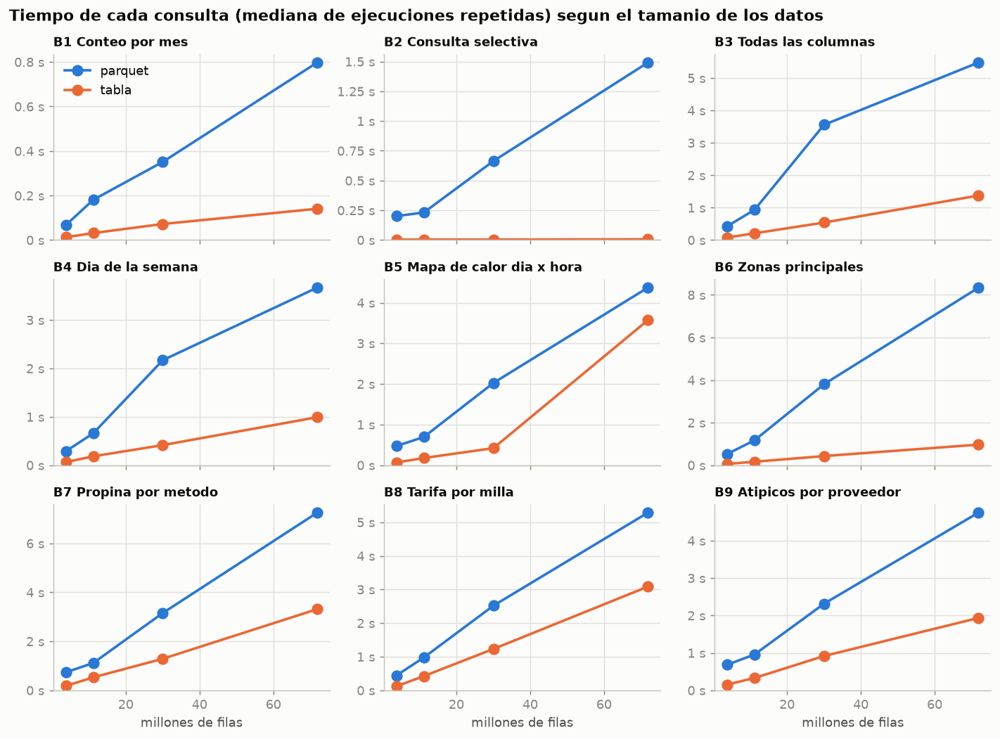
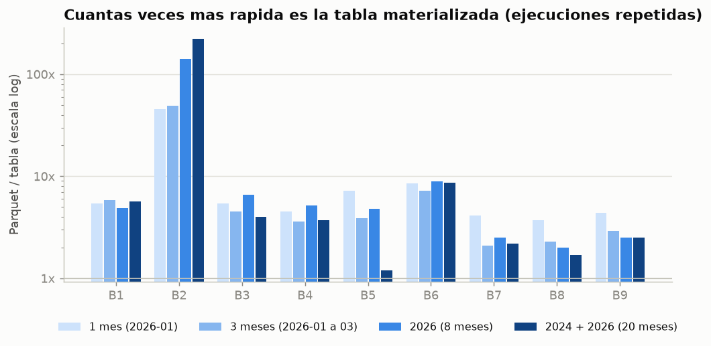
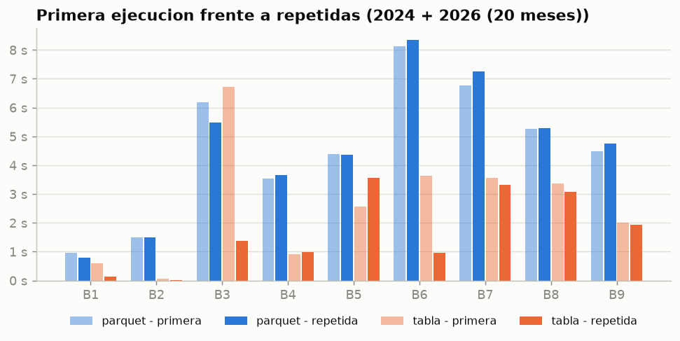

# Ejercicio 6 - Parquet versus tablas DuckDB

Comparacion del desempenio de dos estrategias para ejecutar las mismas
consultas:

- **Parquet**: base DuckDB en memoria; las vistas de
  [`sql/04_analisis/00_vistas.sql`](../sql/04_analisis/00_vistas.sql) leen los
  archivos Parquet en cada consulta.
- **Tabla**: base `.duckdb` creada con
  [`scripts/materializar.py`](../scripts/materializar.py), que copia esas mismas
  vistas a tablas; las consultas leen la tabla materializada.

| Elemento | Ubicacion |
|----------|-----------|
| Materializacion (6.2) | [`scripts/materializar.py`](../scripts/materializar.py) -> `data/processed/taxis.duckdb` |
| Script del benchmark | [`scripts/benchmark.py`](../scripts/benchmark.py) |
| Consultas propias del benchmark | [`sql/06_benchmark/`](../sql/06_benchmark/) |
| Resultados crudos | [`docs/06_benchmark/tiempos.csv`](06_benchmark/tiempos.csv), [`escalas.csv`](06_benchmark/escalas.csv), [`ambiente.txt`](06_benchmark/ambiente.txt) |
| Tablas y graficos | [`notebooks/06_benchmark.ipynb`](../notebooks/06_benchmark.ipynb), `docs/figuras/ej6_*.png` |

Para reproducir:

```bash
docker exec lab8-lab python scripts/materializar.py      # base de 2024 + 2026 (6.2)
docker exec lab8-lab python scripts/benchmark.py         # ~10 minutos; sobrescribe docs/06_benchmark/
docker exec -w /workspace/notebooks lab8-lab jupyter nbconvert --to notebook --execute --inplace 06_benchmark.ipynb
```

Mediciones del 08-oct-2026: DuckDB 1.5.5, 24 hilos, `memory_limit = 3GB`,
Docker Desktop sobre Windows 11, datos en una carpeta del host montada en el
contenedor.

---

## 6.1 Consultas directas sobre Parquet

Es la estrategia usada en los Ejercicios 3 a 5: `read_parquet()` con un patron
glob, envuelto en las vistas temporales de `00_vistas.sql`. Cada consulta
abre los archivos, lee sus metadatos, descomprime las columnas necesarias y
calcula las columnas derivadas (`anio`, `mes_archivo`, `duracion_min`).

## 6.2 Tabla DuckDB materializada

`scripts/materializar.py` crea `data/processed/taxis.duckdb` con:

| Objeto | Tipo | Contenido |
|--------|------|-----------|
| `viajes` | tabla | copia de la vista `viajes`: yellow + green de todos los anios, columnas unificadas y derivadas ya calculadas |
| `zonas`, `metodos_pago` | tablas | tablas de referencia |
| `viajes_validos` | vista | **misma definicion** que en `00_vistas.sql`, ahora sobre la tabla |
| `carga` | tabla | fecha, periodo, archivos y filas de la ultima carga |

Las definiciones no se copian a mano: el script ejecuta `00_vistas.sql`, copia
cada vista temporal con `CREATE TABLE ... AS SELECT * FROM temp.main.<vista>`
y toma la definicion de `viajes_validos` del catalogo (`duckdb_views()`). Asi
las reglas de limpieza siguen viviendo en un solo archivo y las consultas del
Ejercicio 4 funcionan sin cambios sobre la base:

```bash
docker exec lab8-lab python scripts/run_sql.py sql/04_analisis/01_viajes_por_dia_semana.sql --base data/processed/taxis.duckdb
```

Resultado de la carga completa: **71,870,407 filas de 40 archivos en 23-25 s,
2,225 MiB** (frente a 1,172 MiB de los Parquet).

## 6.3 Consultas representativas

Se eligieron nueve consultas con patrones de acceso distintos: tres propias
del benchmark y seis del analisis exploratorio, que se usan **tal cual** desde
`sql/04_analisis/`.

| # | Consulta | Archivo | Que ejercita |
|---|----------|---------|--------------|
| B1 | Conteo por mes | [`06_benchmark/01_conteo_por_mes.sql`](../sql/06_benchmark/01_conteo_por_mes.sql) | Recorrido completo de 3 columnas, agregacion con pocos grupos (costo base de lectura). |
| B2 | Consulta selectiva | [`06_benchmark/02_consulta_selectiva.sql`](../sql/06_benchmark/02_consulta_selectiva.sql) | Un dia y un aeropuerto (~0.01% de las filas): poda de bloques por estadisticas min/max. |
| B3 | Todas las columnas | [`06_benchmark/03_todas_las_columnas.sql`](../sql/06_benchmark/03_todas_las_columnas.sql) | Lee y descomprime todas las columnas (suma de hashes). |
| B4 | Dia de la semana | [`04_analisis/01_viajes_por_dia_semana.sql`](../sql/04_analisis/01_viajes_por_dia_semana.sql) | Funciones de fecha, agregacion en dos niveles, ventana. |
| B5 | Mapa de calor dia x hora | [`04_analisis/03_mapa_calor_dia_hora.sql`](../sql/04_analisis/03_mapa_calor_dia_hora.sql) | Agregacion con muchos grupos (fecha x hora) y `count(DISTINCT)`. |
| B6 | Zonas principales | [`04_analisis/05_zonas_principales.sql`](../sql/04_analisis/05_zonas_principales.sql) | Dos agregaciones, `JOIN` con zonas, ventanas. |
| B7 | Propina por metodo | [`04_analisis/14_propina_por_metodo.sql`](../sql/04_analisis/14_propina_por_metodo.sql) | Medianas (agregados que requieren ordenar). |
| B8 | Tarifa por milla | [`04_analisis/17_tarifa_por_milla_por_distancia.sql`](../sql/04_analisis/17_tarifa_por_milla_por_distancia.sql) | Cuantiles por grupo. |
| B9 | Atipicos por proveedor | [`04_analisis/19_atipicos_por_proveedor.sql`](../sql/04_analisis/19_atipicos_por_proveedor.sql) | Muchas columnas, `UNPIVOT`, sobre la tabla sin filtrar. |

## 6.4 - 6.6 Metodologia

- **Mismo texto SQL en ambas estrategias**: solo cambia si `viajes` es una
  vista sobre Parquet o una tabla. Para que la comparacion sea valida, el
  script **verifica que ambas devuelvan el mismo resultado** en cada consulta
  y escala (`pandas.testing.assert_frame_equal`); las 36 comparaciones
  coincidieron.
- **Primera y repetidas**: cada consulta se ejecuta una vez en una conexion
  recien abierta (*primera*, sin datos en la cache de DuckDB) y tres veces mas
  (*repetida*; se reporta la mediana). Despues de cargar la tabla, la base se
  cierra y se vuelve a abrir en solo lectura, para que su primera ejecucion no
  aproveche los bloques recien escritos. La cache del sistema operativo no se
  puede vaciar desde el contenedor, por lo que la "primera" ejecucion sobre
  Parquet puede encontrar los archivos ya en esa cache.
- **Cuatro escalas de datos (6.6)** definidas con el mismo mecanismo de alcance
  del Ejercicio 5 (`periodo`):

| Escala | Periodo | Archivos | Filas (M) | Parquet (MiB) | Tabla (MiB) | Tabla / Parquet | Carga de la tabla (s) |
|--------|---------|---------:|----------:|--------------:|------------:|----------------:|----------------------:|
| 1 mes | 2026-01 | 2 | 3.77 | 62.1 | 118.0 | 1.90 | 1.98 |
| 3 meses | 2026-01 a 03 | 6 | 11.20 | 184.8 | 357.0 | 1.93 | 4.96 |
| 2026 | 8 meses | 16 | 30.04 | 495.7 | 938.0 | 1.89 | 11.00 |
| 2024 + 2026 | 20 meses | 40 | 71.87 | 1,171.7 | 2,225.3 | 1.90 | 24.94 |

## 6.7 Resultados

**Escala completa (2024 + 2026, 71.9 M filas), segundos.** `x` = cuantas veces
mas lenta es la consulta sobre Parquet que sobre la tabla.

| # | Consulta | Primera: Parquet | Primera: tabla | x | Repetida: Parquet | Repetida: tabla | x |
|---|----------|-----:|-----:|-----:|-----:|-----:|------:|
| B1 | Conteo por mes | 0.97 | 0.60 | 1.6 | 0.80 | 0.14 | 5.7 |
| B2 | Consulta selectiva | 1.50 | 0.07 | 20.1 | 1.49 | 0.01 | 222.5 |
| B3 | Todas las columnas | 6.18 | 6.72 | **0.9** | 5.48 | 1.37 | 4.0 |
| B4 | Dia de la semana | 3.54 | 0.92 | 3.8 | 3.67 | 0.99 | 3.7 |
| B5 | Mapa de calor dia x hora | 4.39 | 2.56 | 1.7 | 4.37 | 3.57 | **1.2** |
| B6 | Zonas principales | 8.14 | 3.63 | 2.2 | 8.34 | 0.97 | 8.6 |
| B7 | Propina por metodo | 6.77 | 3.56 | 1.9 | 7.25 | 3.31 | 2.2 |
| B8 | Tarifa por milla | 5.27 | 3.36 | 1.6 | 5.28 | 3.08 | 1.7 |
| B9 | Atipicos por proveedor | 4.48 | 2.01 | 2.2 | 4.75 | 1.93 | 2.5 |

**Todas las escalas, mediana de ejecuciones repetidas (s):**

| # | 1 mes: Parquet | tabla | x | 3 meses: Parquet | tabla | x | 2026: Parquet | tabla | x | 2024+2026: Parquet | tabla | x |
|---|----:|----:|----:|----:|----:|----:|----:|----:|----:|----:|----:|----:|
| B1 | 0.07 | 0.01 | 5.4 | 0.18 | 0.03 | 5.8 | 0.35 | 0.07 | 4.9 | 0.80 | 0.14 | 5.7 |
| B2 | 0.20 | 0.00 | 45.8 | 0.23 | 0.01 | 49.4 | 0.66 | 0.01 | 141.3 | 1.49 | 0.01 | 222.5 |
| B3 | 0.43 | 0.08 | 5.4 | 0.93 | 0.21 | 4.5 | 3.56 | 0.54 | 6.6 | 5.48 | 1.37 | 4.0 |
| B4 | 0.29 | 0.06 | 4.5 | 0.66 | 0.18 | 3.6 | 2.17 | 0.42 | 5.2 | 3.67 | 0.99 | 3.7 |
| B5 | 0.47 | 0.07 | 7.2 | 0.70 | 0.18 | 3.9 | 2.03 | 0.42 | 4.8 | 4.37 | 3.57 | 1.2 |
| B6 | 0.52 | 0.06 | 8.5 | 1.17 | 0.16 | 7.2 | 3.81 | 0.43 | 8.9 | 8.34 | 0.97 | 8.6 |
| B7 | 0.73 | 0.18 | 4.1 | 1.12 | 0.53 | 2.1 | 3.16 | 1.29 | 2.5 | 7.25 | 3.31 | 2.2 |
| B8 | 0.44 | 0.12 | 3.7 | 0.98 | 0.42 | 2.3 | 2.52 | 1.23 | 2.0 | 5.28 | 3.08 | 1.7 |
| B9 | 0.68 | 0.15 | 4.4 | 0.96 | 0.33 | 2.9 | 2.32 | 0.92 | 2.5 | 4.75 | 1.94 | 2.5 |

**Las nueve consultas juntas (suma de medianas repetidas) y costo de la carga:**

| Escala | Parquet (s) | Tabla (s) | x | Carga de la tabla (s) | Ejecuciones del conjunto para amortizar la carga |
|--------|-----:|-----:|----:|-----:|----:|
| 1 mes | 3.84 | 0.74 | 5.2 | 1.98 | 0.6 |
| 3 meses | 6.92 | 2.05 | 3.4 | 4.96 | 1.0 |
| 2026 | 20.56 | 5.32 | 3.9 | 11.00 | 0.7 |
| 2024 + 2026 | 41.43 | 15.38 | 2.7 | 24.94 | 1.0 |







## 6.8 Consultas del benchmark

Ver la tabla de 6.3: cada consulta es un archivo `.sql` versionado con su
objetivo en el encabezado, y la lista de consultas y escalas esta en las
constantes `CONSULTAS` y `ESCALAS` de [`scripts/benchmark.py`](../scripts/benchmark.py).

## 6.9 Analisis de los resultados

1. **La tabla es mas rapida en todas las consultas repetidas** (de 1.2 a 222
   veces; el conjunto completo, de 2.7 a 5.2 veces). Sobre Parquet, cada
   consulta vuelve a abrir los archivos, decodificar el formato Parquet,
   descomprimir las columnas y calcular las columnas derivadas de la vista
   (`anio` y `mes_archivo` con una expresion regular sobre el nombre del
   archivo, `duracion_min`). En la tabla esas columnas ya estan calculadas y,
   despues de la primera lectura, los bloques quedan en la cache de DuckDB en
   su formato nativo.

2. **La diferencia es maxima en la consulta selectiva (B2: 20x en frio, 222x
   repetida).** La tabla se cargo en orden cronologico (archivo por archivo),
   por lo que los *zonemaps* (min/max de cada bloque) de `inicio` descartan casi
   toda la tabla y solo se leen los bloques del 15 de enero de 2026: la consulta
   tarda lo mismo con 1 o con 20 meses (~0.01 s). Sobre Parquet tambien hay
   poda por estadisticas de row group, pero el costo crece con la **cantidad de
   archivos** (0.20 s con 2 archivos, 1.49 s con 40): DuckDB debe abrir cada
   archivo y leer su pie en cada consulta.

3. **En la primera ejecucion la ventaja casi desaparece** (1.6-2.2x en la
   mayoria; B3 incluso es 10% mas lenta sobre la tabla). La tabla ocupa 1.9
   veces mas que los Parquet (DuckDB usa compresiones ligeras pensadas para
   descomprimir rapido; los Parquet de la TLC usan ZSTD, una compresion
   general mas agresiva), asi que leerla completa desde disco por primera vez cuesta mas.
   La ganancia de la tabla viene sobre todo de **reutilizar** datos ya
   cargados en memoria.

4. **Las consultas dominadas por calculo ganan menos** (B7 medianas, B8
   cuantiles, B9 `UNPIVOT`: 1.7-2.5x en la escala completa). Su costo esta en
   ordenar valores y agregar, y ese trabajo es identico en ambas estrategias;
   la tabla solo ahorra la parte de lectura. En cambio, las consultas que leen
   mucho y calculan poco (B1, B3, B6) ganan 4-9x.

5. **Anomalia: B5 con la escala completa (1.2x).** Con 30 M filas la tabla
   tardaba 0.42 s y con 72 M filas 3.57 s (8.5 veces mas con 2.4 veces mas
   datos). Repitiendo la consulta con distintos limites de memoria:

   | `memory_limit` | ejecuciones (s) |
   |----------------|-----------------|
   | 3GB (el del benchmark) | 4.26, 3.15, 3.16, 3.03 |
   | 6GB | 3.77, 0.98, 1.07, 1.00 |

   Con 6 GB vuelve a escalar linealmente (~1 s). Con 3 GB, la tabla en cache
   (2.2 GB) y la tabla hash de la agregacion (muchos grupos fecha x hora) no
   caben juntas: DuckDB desaloja bloques de la tabla y los vuelve a leer del
   disco en cada ejecucion (no se generaron archivos temporales, no es
   *spill*). **La ventaja de materializar depende de que haya memoria para
   mantener la tabla en cache.**

6. **Ambas estrategias escalan aproximadamente lineal con las filas**, pero
   la pendiente de Parquet es mayor y tiene un costo fijo por archivo (B2).
   La relacion `x` es parecida entre escalas para casi todas las consultas,
   por lo que la ventaja relativa de la tabla no crece con el volumen; la
   ventaja **absoluta** si (la suma pasa de 3 s ahorrados con 1 mes a 26 s con
   20 meses).

7. **La carga se amortiza rapido**: materializar cuesta lo mismo que ejecutar
   una vez el conjunto de nueve consultas sobre Parquet (0.6-1.0 ejecuciones).
   A cambio, la tabla duplica el espacio en disco y debe **reconstruirse**
   cada vez que llegan archivos nuevos (25 s hoy, creciendo con los datos),
   mientras que las vistas sobre Parquet ven los archivos nuevos de inmediato.

8. **Contexto del ambiente.** Los datos estan en una carpeta de Windows montada
   en el contenedor Linux de Docker Desktop, una ruta de E/S mas lenta que un
   disco local; esto penaliza mas a la estrategia que lee del disco en cada
   consulta (Parquet) y a las primeras ejecuciones. En un disco local las
   diferencias absolutas serian menores.

## 6.10 ¿Cuando usar cada estrategia?

**Consultar directamente los Parquet es apropiado cuando:**

- el analisis es **exploratorio o puntual** (pocas ejecuciones de cada
  consulta), como en los Ejercicios 3 y 4: no se paga la carga ni el doble
  almacenamiento, y 1-8 s por consulta sobre 72 M filas es aceptable;
- los datos **cambian o crecen con frecuencia** (llegan meses nuevos, la TLC
  republica archivos): las vistas ven los cambios sin ningun paso extra y no
  hay una copia que pueda quedar desactualizada;
- se quiere **validar o inspeccionar archivos** (esquema, metadatos, filas):
  `parquet_file_metadata`/`parquet_schema` responden en milisegundos sin leer
  datos;
- el **espacio en disco** o la memoria son limitados (la tabla ocupa 1.9 veces
  mas, y su ventaja depende de mantenerla en memoria, ver punto 5);
- los datos son compartidos por varias herramientas: Parquet es un formato
  abierto que leen pandas, Spark, Polars, etc., mientras que un `.duckdb` admite
  un solo proceso con escritura.

**Materializar una tabla DuckDB conviene cuando:**

- las **mismas consultas se ejecutan muchas veces** sobre datos que no cambian
  entre cargas: tableros, reportes recurrentes, benchmarks. La carga se
  amortiza en la primera ejecucion del conjunto y despues cada consulta es
  2-9 veces mas rapida;
- hay **consultas selectivas o interactivas** (filtros por fecha, zona,
  proveedor) donde la respuesta debe ser inmediata: los zonemaps de una tabla
  ordenada las resuelven en milisegundos;
- la preparacion de los datos es costosa (uniones, columnas derivadas,
  limpieza) y conviene hacerla **una vez** y no en cada consulta;
- una herramienta externa necesita **una base con tablas** y no rutas de
  archivos, como Metabase en el Ejercicio 7.

En este laboratorio se usan ambas: Parquet como **fuente de verdad** y para
la exploracion, y una tabla reconstruible con un comando
(`scripts/materializar.py`) para el tablero del Ejercicio 7, que ejecuta las
mismas consultas cada vez que alguien lo abre.
