# Ejercicio 7 - Construccion de indicadores y visualizacion

Indicadores sobre los viajes de taxis amarillos y verdes de **2024 y 2026**
(enero-agosto de 2026), calculados con DuckDB sobre la base materializada
`data/processed/taxis.duckdb` y visualizados en **Metabase**.

| Elemento | Ubicacion |
|----------|-----------|
| Consultas SQL (una por indicador; pregunta, definicion y visualizacion en el encabezado) | [`sql/07_indicadores/`](../sql/07_indicadores/) |
| Visualizaciones en Metabase (creadas por codigo) | [`scripts/metabase_indicadores.py`](../scripts/metabase_indicadores.py) -> coleccion "Lab 8 - Indicadores" |
| Las mismas visualizaciones con matplotlib (evidencia versionada) | [`notebooks/07_indicadores.ipynb`](../notebooks/07_indicadores.ipynb), `docs/figuras/ej7_*.png` |

Para reproducir (con el ambiente levantado y los datos descargados):

```bash
docker exec lab8-lab python scripts/materializar.py                                # base de 2024 + 2026
docker exec lab8-lab python scripts/run_sql.py sql/07_indicadores --base data/processed/taxis.duckdb
docker exec --env-file .env lab8-lab python scripts/metabase_indicadores.py        # visualizaciones en Metabase
docker exec -w /workspace/notebooks lab8-lab jupyter nbconvert --to notebook --execute --inplace 07_indicadores.ipynb
```

`.env` (no versionado) contiene `MB_USER` y `MB_PASSWORD` de un administrador
de Metabase. Si `materializar.py` falla porque la base esta en uso, detenga
Metabase (`docker compose stop metabase`), materialice y vuelva a iniciarlo.

Resultados obtenidos el 08-oct-2026 con DuckDB 1.5.5 y Metabase v0.63.19.

---

## Decisiones generales

- **Fuente: la tabla materializada, no los Parquet.** Un tablero ejecuta las
  mismas consultas cada vez que se abre o se filtra; el Ejercicio 6 mostro que
  en ese escenario la tabla es 2-9 veces mas rapida y que su carga (25 s) se
  amortiza en la primera ejecucion. Ademas Metabase necesita una base con
  tablas. Las 11 consultas tardan entre 0.1 y 5 s sobre 72 M de filas.
- **Metabase abre la base en solo lectura**, para que notebooks y scripts
  puedan leerla al mismo tiempo (un `.duckdb` admite un solo proceso con
  escritura).
- **Visualizaciones creadas por codigo.** Las preguntas de Metabase se guardan
  en su volumen de Docker, fuera del repositorio. `metabase_indicadores.py`
  las crea o actualiza a partir de los `.sql` versionados (registra la base,
  crea la coleccion, una pregunta por indicador con su tipo de grafico, y
  ejecuta cada una para verificarla). Si cambia una consulta basta con volver a
  ejecutar el script.
- **Comparaciones justas entre anios.** 2026 solo tiene enero-agosto. Los
  indicadores por mes comparan mes contra mes; los que agregan un anio
  completo (I4, I7, I8, I9, I10) se limitan a los **meses publicados en todos
  los anios cargados**, calculados en la propia consulta (`meses_comunes`), no
  escritos a mano.
- **Preparados para el Ejercicio 8.** Ninguna consulta tiene un anio fijo: los
  anios salen de los datos (`anio`, `lag()` sobre el anio anterior disponible,
  `max(anio)`), y los colores de los graficos estan fijos por anio (2024 azul,
  2026 naranja, 2025 reservado en aqua) para que agregar un anio no cambie los
  colores existentes.
- **`viajes` o `viajes_validos` segun la pregunta.** Los indicadores de volumen
  (I1, I2, I5, I7, I9) cuentan todos los registros: un registro con la hora mal
  capturada sigue siendo un viaje (y excluirlos subestimaria 2026, ver Helix en
  el Ejercicio 5). Los que miden montos, distancias o velocidades usan
  `viajes_validos`.

## 7.1 Preguntas de analisis

| # | Pregunta | Eje |
|---|----------|-----|
| P1 | ¿Cuantos viajes se realizan cada mes y como se compara la demanda de un anio con la del otro? | Demanda |
| P2 | ¿La demanda crece o cae respecto al mismo mes del anio anterior, y evolucionan igual yellow y green? | Demanda / tipos de taxi |
| P3 | ¿Cuanto paga un pasajero por un viaje tipico y como cambia ese monto en el tiempo? | Precio |
| P4 | ¿Que componentes explican lo que se cobra por un viaje y cuanto aporta el cargo por congestion (CBD) introducido en 2025? | Precio / regulacion |
| P5 | ¿Como pagan los pasajeros y esta cambiando la mezcla de metodos de pago? | Pago |
| P6 | ¿Que tan generosas son las propinas y cambian entre anios? | Pago |
| P7 | ¿En que horas se concentra la demanda en dias laborables y en fines de semana, y se mantiene el patron entre anios? | Temporal |
| P8 | ¿Que tan congestionado esta el trafico a cada hora y cambio la velocidad despues de la tarifa de congestion de 2025? | Operacion / regulacion |
| P9 | ¿Donde se origina la demanda y cambiaron las zonas principales entre anios? | Geografia |
| P10 | ¿Que parte de los viajes y de los ingresos corresponde a viajes desde o hacia los aeropuertos? | Segmentos |
| P11 | ¿Que tan confiables son los registros de cada mes? ¿Empeora o mejora la calidad de los datos? | Calidad de datos |

## 7.2 Diseno de los indicadores

| Ind. | Pregunta | Indicador (definicion) | Granularidad | Fuente | Visualizacion | Por que este indicador |
|------|----------|------------------------|--------------|--------|---------------|------------------------|
| I1 | P1 | Viajes registrados | mes x anio | `viajes` | lineas, una por anio | El volumen es la medida basica de la demanda; una linea por anio sobre el mismo eje de meses muestra a la vez estacionalidad y nivel. |
| I2 | P2 | (viajes del mes / viajes del mismo mes del anio anterior - 1) x 100 | mes x tipo | `viajes` | barras con base en 0 | Comparar el mismo mes elimina la estacionalidad; separar yellow y green evita que el volumen de yellow (95%) oculte la tendencia de green. Barras divergentes desde 0 muestran crecimiento y caida de un vistazo. |
| I3 | P3 | Mediana de `total_amount` por viaje (yellow, total > 0) | mes x anio | `viajes_validos` | lineas | La mediana describe el viaje tipico sin el sesgo de viajes largos/aeropuerto; se limita a yellow para no confundir cambios de precio con cambios en la mezcla de tipos. |
| I4 | P4 | Promedio por viaje de cada componente del total (tarifa, propina, peajes, cargo aeropuerto, cargo CBD, otros recargos) | anio (ene-ago) | `viajes_validos` | barras apiladas horizontales | El promedio si se puede descomponer en partes que suman el total; muestra **que** explica el cambio de precio de I3, incluido el cargo nuevo. |
| I5 | P5 | % de viajes por metodo de pago (tarjeta, Flex Fare, efectivo, otros) | mes | `viajes` | barras apiladas al 100% | Una parte del todo por mes; el Ejercicio 4 mostro que Flex Fare es un fenomeno nuevo y relevante. |
| I6 | P6 | % de viajes pagados con tarjeta que incluyen propina (referencia: propina promedio %) | mes x anio | `viajes_validos` | lineas | Solo con tarjeta la propina queda registrada. La mediana de la propina es 20% fija en todos los meses (la opcion sugerida por la pantalla), por eso se mide la proporcion que deja propina, que si varia. |
| I7 | P7 | Viajes promedio por fecha que inician en cada hora | hora x tipo de dia x anio | `viajes` | lineas, un panel por tipo de dia | Promediar por fecha hace comparables anios con distinto numero de dias; separa el patron laborable (picos de traslado) del de fin de semana (noche). |
| I8 | P8 | Mediana de distancia / duracion (mph) de viajes yellow dentro de Manhattan, laborables | hora x anio (ene-ago) | `viajes_validos` + `zonas` | lineas | La velocidad de los taxis es una medida indirecta del trafico; se limita a Manhattan, donde se cobra el cargo de congestion. |
| I9 | P9 | % de los viajes del anio que inician en cada zona (top 10 del anio mas reciente) | zona x anio (ene-ago) | `viajes` + `zonas` | barras horizontales agrupadas | Los porcentajes permiten comparar anios de distinto tamanio; barras horizontales para nombres de zona largos. |
| I10 | P10 | % de viajes y % de ingresos de viajes con origen o destino en JFK, LaGuardia o Newark | aeropuerto x anio (ene-ago) | `viajes_validos` + `zonas` | barras agrupadas, dos paneles | Comparar % de ingresos con % de viajes muestra cuanto mas valioso es un viaje de aeropuerto. |
| I11 | P11 | % de registros del mes que no pasan las reglas de calidad (fuera de `viajes_validos`) | mes x tipo | `viajes` + `viajes_validos` | lineas | Un tablero debe decir cuanta informacion se descarto; si la tasa cambia, los demas indicadores podrian cambiar por la limpieza y no por el comportamiento. |

## 7.3 Consultas SQL

Cada indicador es un archivo en [`sql/07_indicadores/`](../sql/07_indicadores/)
con la pregunta, la definicion, la fuente, las decisiones y el tipo de
visualizacion en el encabezado. Son una sola sentencia `SELECT`, para que
puedan usarse sin cambios como pregunta SQL nativa de Metabase.

| Ind. | Archivo | Tiempo (s) | Filas |
|------|---------|----------:|------:|
| I1 | [`01_viajes_por_mes.sql`](../sql/07_indicadores/01_viajes_por_mes.sql) | 0.25 | 20 |
| I2 | [`02_variacion_interanual.sql`](../sql/07_indicadores/02_variacion_interanual.sql) | 0.21 | 16 |
| I3 | [`03_costo_por_viaje.sql`](../sql/07_indicadores/03_costo_por_viaje.sql) | 4.76 | 20 |
| I4 | [`04_composicion_del_cobro.sql`](../sql/07_indicadores/04_composicion_del_cobro.sql) | 1.08 | 12 |
| I5 | [`05_metodos_de_pago.sql`](../sql/07_indicadores/05_metodos_de_pago.sql) | 0.41 | 80 |
| I6 | [`06_propina_con_tarjeta.sql`](../sql/07_indicadores/06_propina_con_tarjeta.sql) | 0.93 | 20 |
| I7 | [`07_demanda_por_hora.sql`](../sql/07_indicadores/07_demanda_por_hora.sql) | 0.57 | 96 |
| I8 | [`08_velocidad_manhattan.sql`](../sql/07_indicadores/08_velocidad_manhattan.sql) | 2.18 | 48 |
| I9 | [`09_zonas_de_origen.sql`](../sql/07_indicadores/09_zonas_de_origen.sql) | 0.10 | 20 |
| I10 | [`10_aeropuertos.sql`](../sql/07_indicadores/10_aeropuertos.sql) | 0.79 | 12 |
| I11 | [`11_calidad_de_datos.sql`](../sql/07_indicadores/11_calidad_de_datos.sql) | ~1 | 40 |

(tiempos con `run_sql.py --base data/processed/taxis.duckdb`, primera
ejecucion.)

## 7.4 Visualizaciones

### En Metabase

`scripts/metabase_indicadores.py` registra la base y crea 11 preguntas en la
coleccion **Lab 8 - Indicadores** (<http://localhost:3000/collection/5>):

| Ind. | Pregunta de Metabase | Tipo de grafico |
|------|----------------------|-----------------|
| I1 | I1 Viajes por mes | lineas (serie = anio) |
| I2 | I2 Variacion interanual de viajes por tipo de taxi | barras (serie = tipo) |
| I3 | I3 Costo tipico de un viaje (total mediano, yellow) | lineas (serie = anio) |
| I4 | I4 Composicion del cobro promedio por viaje (yellow, ene-ago) | barras apiladas |
| I5 | I5 Metodos de pago por mes | barras apiladas |
| I6 | I6 Viajes con propina (pagos con tarjeta) | lineas (serie = anio) |
| I7 | I7 Demanda promedio por hora del dia | lineas (serie = anio + tipo de dia) |
| I8 | I8 Velocidad mediana en Manhattan por hora (laborables, yellow) | lineas (serie = anio) |
| I9 | I9 Zonas con mas viajes de origen | barras horizontales (serie = anio) |
| I10 | I10 Aeropuertos: participacion en viajes e ingresos (ene-ago) | barras (serie = anio + medida) |
| I11 | I11 Registros que no pasan las reglas de calidad | lineas (serie = tipo) |

Cada pregunta lleva como descripcion el encabezado de su archivo SQL. La
organizacion de estas preguntas en un tablero corresponde al 7.5.

### Con matplotlib (evidencia versionada)

Las mismas consultas, dibujadas en `notebooks/07_indicadores.ipynb`. Debajo de
cada figura, una lectura breve del indicador; la discusion conjunta de los
hallazgos corresponde al 7.8.

**I1 - Viajes por mes.** En enero-agosto hubo 30.0 M de viajes en 2026 frente
a 26.8 M en 2024 (+12%). La estacionalidad es la misma en ambos anios: picos en
marzo-mayo y caida en julio-agosto.

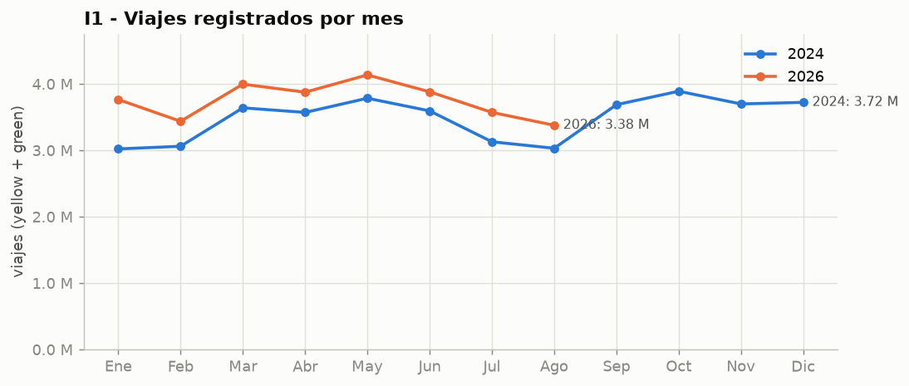

**I2 - Variacion interanual.** Los taxis amarillos crecen en todos los meses
(+8% a +26%) y los verdes caen en todos (-19% a -30%): las dos flotas siguen
tendencias opuestas, algo que el total de I1 oculta.

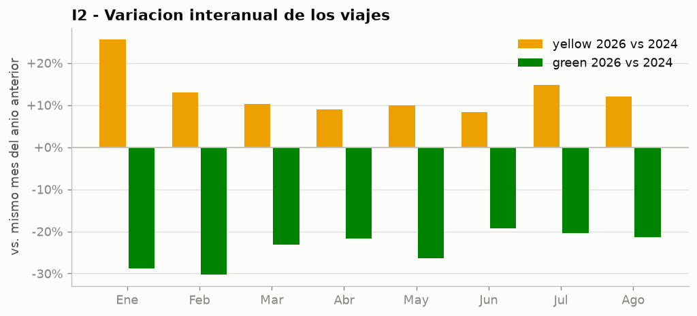

**I3 - Costo tipico.** El total mediano de un viaje yellow paso de $20.90 a
$23.62 en promedio de enero-agosto (+13%). La distancia mediana tambien subio
(1.79 a 1.94 mi), por lo que parte del aumento se debe a viajes mas largos.

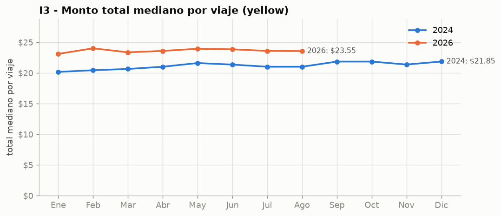

**I4 - Composicion del cobro.** El cobro promedio paso de $28.33 a $30.24
(+$1.91). La tarifa base explica la mayor parte (+$1.76); el cargo de
congestion CBD agrega $0.54 por viaje en promedio (se cobra solo a los viajes
que entran a la zona); la propina promedio **baja** $0.46 (ver I5 e I6).

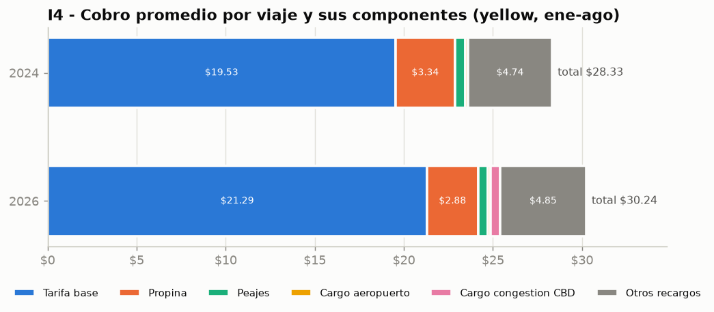

**I5 - Metodos de pago.** La tarjeta paso de 72-78% a 60-69% de los viajes y
el efectivo de 12-15% a 8-10%, mientras que Flex Fare paso de 5-13% a 21-30%:
en 2024 Flex Fare nunca supero el 13.2% y en 2026 nunca bajo del 20.8%.

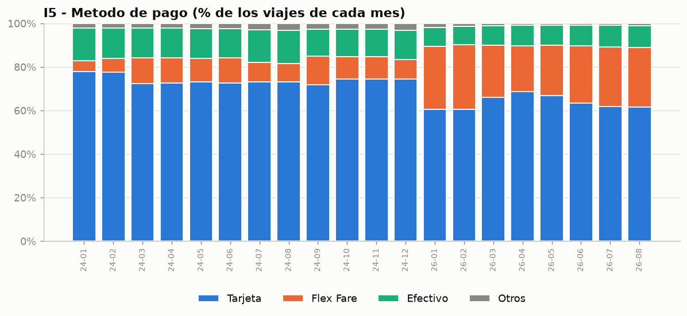

**I6 - Propina con tarjeta.** El 94.4% de los viajes con tarjeta tenia propina
en 2024 y el 91.1% en 2026 (enero-agosto); cuando hay propina, su tamanio casi
no cambia (17.6% vs 17.0% promedio). Junio de 2026 se aparta (94.8%); coincide
con el primer mes que incluye `request_source`, por lo que podria tratarse de
un cambio en el registro y no en el comportamiento.

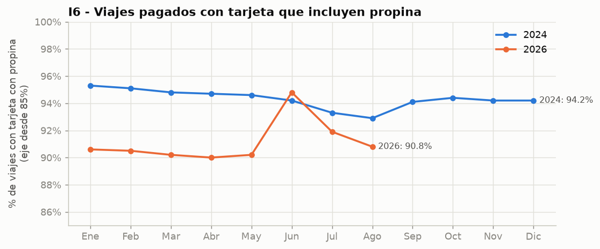

**I7 - Demanda por hora.** El patron es el mismo en ambos anios: minimo a las
4-5 h, pico de la tarde a las 18 h en laborables (8,283 viajes promedio en
2024; 9,151 en 2026) y demanda nocturna alta en fines de semana. El
crecimiento de 2026 se reparte en todas las horas.

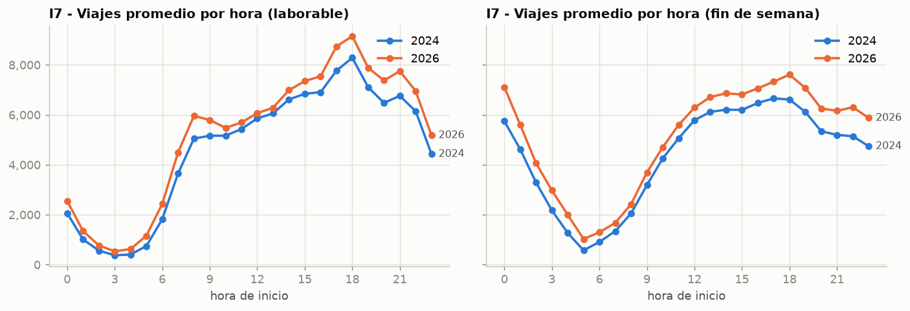

**I8 - Velocidad en Manhattan.** El trafico es mas lento entre las 10 y las
17 h (~7 mph). Contra lo esperado tras el cargo de congestion, en 2026 los
viajes dentro de Manhattan fueron **0.4-0.6 mph mas lentos** que en 2024 entre
las 10 y las 20 h, con 4% mas viajes yellow en ese segmento. Sin 2025 no se
puede separar el efecto inicial del cargo de lo ocurrido despues (Ejercicio 8).

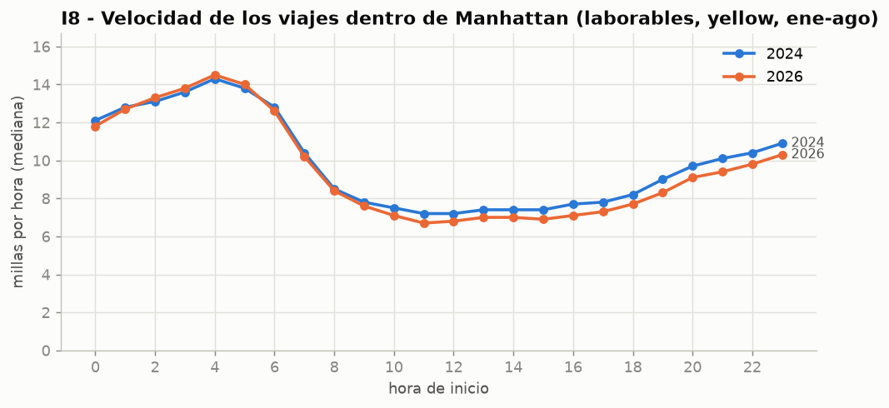

**I9 - Zonas de origen.** Las 10 zonas principales de 2026 (9 en Manhattan y
JFK) ya eran zonas de alta demanda en 2024, pero 9 de ellas pierden
participacion: la demanda de 2026 esta menos concentrada. JFK baja de 4.8% a
3.9% (coherente con I10); East Village es la unica que sube (2.3% a 2.6%).

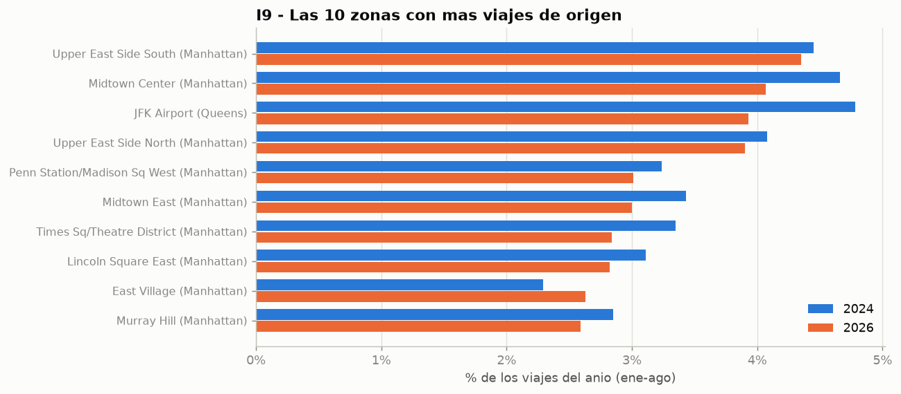

**I10 - Aeropuertos.** JFK y LaGuardia concentran 9.8% de los viajes pero
26.7% de los ingresos en 2024 (un viaje de aeropuerto vale unas 2.7 veces el
promedio). Su peso baja en 2026: 7.9% de los viajes y 20.2% de los ingresos.

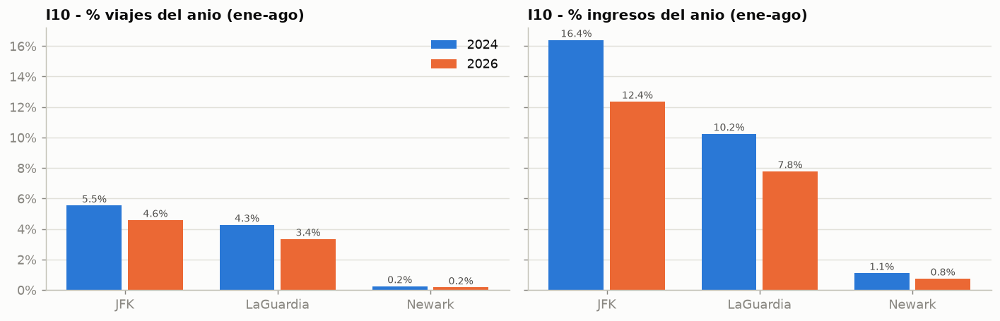

**I11 - Calidad de datos.** Entre 3% y 6% de los registros de cada mes no
pasan las reglas. En yellow la tasa sube en 2026 (4-5.6%) por los registros
de Helix con duracion cero (Ejercicio 5); en green baja (de ~5.5% a ~3.5-4.6%).

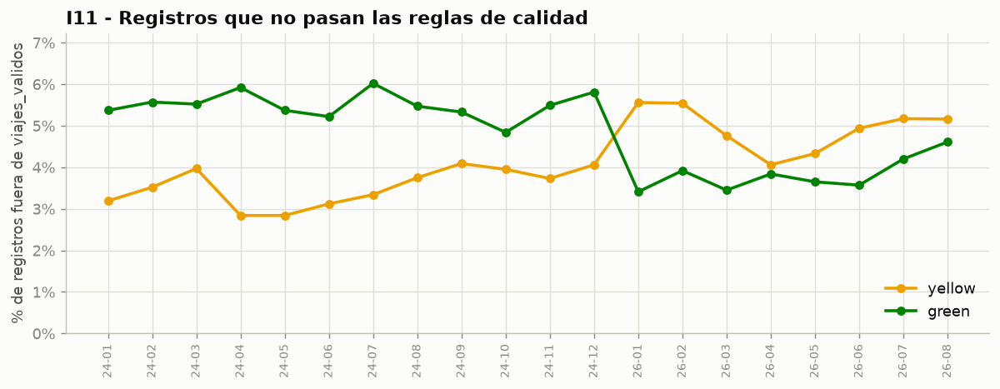

---

## Pendiente (7.5 - 7.8)

- **7.5** Organizar las 11 preguntas en un tablero de Metabase y guardar la
  evidencia (capturas) en `docs/figuras/`.
- **7.6** Ampliar la justificacion de cada indicador (la columna "Por que este
  indicador" de 7.2 es el punto de partida).
- **7.7** Las consultas ya estan documentadas en `sql/07_indicadores/` (7.3).
- **7.8** Interpretacion conjunta y discusion de los hallazgos principales.
