# Informe del Laboratorio 8. Análisis de viajes de taxi de Nueva York con DuckDB

Curso CC3084 Data Science. Universidad del Valle de Guatemala. Ciclo 2 de 2026.

Integrantes: Melisa

Repositorio de entrega: github.com/melisadmendizabal/DataS_Lab8_duckdb

Fecha: 7 de octubre de 2026

---

## Resumen

Este informe documenta la construcción de un flujo de trabajo reproducible para descargar, organizar, consultar y analizar los registros de viajes de taxis amarillos y verdes publicados por la Comisión de Taxis y Limusinas de la ciudad de Nueva York. El trabajo se desarrolló sobre un ambiente basado en contenedores y utilizó DuckDB como motor analítico, consultando directamente los archivos en formato Parquet sin importarlos previamente a una base de datos.

El conjunto de datos analizado comprende los meses de enero a agosto de 2026, que eran los meses publicados al momento del trabajo. Contiene 30,040,469 viajes distribuidos en dieciséis archivos mensuales. Durante el laboratorio se corrigió el script de descarga proporcionado y se exploró la estructura y la calidad de los datos. Por último, se respondieron seis preguntas analíticas sobre el comportamiento temporal, las zonas de servicio, el pago, las tarifas y el origen de las inconsistencias.

Entre los hallazgos principales destacan cuatro. Los viajes con tarifa flexible corresponden mayoritariamente a viajes solicitados por aplicación. Los errores de registro se concentran en proveedores específicos. Los viajes de aeropuerto generan una proporción de ingresos muy superior a su proporción de viajes. Por último, la congestión vehicular encarece cada milla recorrida en cerca de un cincuenta por ciento.

---

## Introducción

### Objetivo del laboratorio

El objetivo del laboratorio es comprender y aplicar el uso de DuckDB para realizar análisis sobre grandes volúmenes de datos almacenados en archivos Parquet. Para ello se construyó un flujo reproducible que permite descargar, organizar, consultar, transformar y visualizar información que crece de forma progresiva. También se evaluaron distintas estrategias de acceso a los datos y se discutieron las ventajas de DuckDB en escenarios de análisis a gran escala.

### Descripción del caso

El caso plantea un equipo de análisis que trabaja con información de viajes de taxi de la ciudad de Nueva York. Los datos se reciben como archivos mensuales independientes y se incorporan nuevos archivos a medida que se generan registros. El equipo debe responder preguntas analíticas sin depender de un servidor de base de datos tradicional. Además, debe mantener un proceso que pueda repetirse cada vez que lleguen datos nuevos.

### Fuente de datos

Se utilizó el conjunto de datos de viajes publicado por la Comisión de Taxis y Limusinas de Nueva York. Cada archivo corresponde a un tipo de taxi y a un mes, y está almacenado en formato Parquet. La comisión publica cada mes con varias semanas de atraso. Por esa razón, al momento de este trabajo solo estaban disponibles los meses de enero a agosto de 2026.

### Estructura del proyecto

El repositorio base organiza el trabajo en un conjunto de directorios con propósitos diferenciados. La siguiente tabla resume la función que se le atribuyó a cada uno después de analizar la estructura.

| Directorio o archivo | Propósito |
|---|---|
| data, subdirectorio raw | Datos originales tal como los publica la comisión, organizados por tipo de taxi y año. No se modifican y constituyen la fuente a partir de la cual se regenera todo lo demás. |
| data, subdirectorio processed | Resultados derivados de los datos originales, como datos limpios, tablas agregadas o bases materializadas. Puede eliminarse y volver a generarse con los scripts. |
| notebooks | Cuadernos de Jupyter para la exploración, el análisis y las visualizaciones. |
| scripts | Programas en Python reproducibles para la descarga, la preparación de datos, la ejecución de consultas y las mediciones de desempeño. |
| sql | Consultas SQL guardadas como archivos individuales, de modo que queden versionadas y documentadas. |
| docs | Documentación del trabajo, explicación de consultas, figuras y evidencia de resultados. |
| Dockerfile | Definición de la imagen del ambiente de análisis con Python, JupyterLab, DuckDB y librerías de apoyo. |
| metabase.Dockerfile | Definición de la imagen de Metabase con el controlador de DuckDB para construir tableros. |
| docker-compose.yml | Orquestación de los dos servicios, sus puertos y los volúmenes que conectan las carpetas del proyecto con los contenedores. |
| README.md | Instrucciones para reproducir el trabajo completo. |

Los directorios de datos están excluidos del control de versiones. Así, el repositorio conserva el proceso y no los datos, que se regeneran mediante los scripts.

---

## Ejercicio 1. Preparación del ambiente

### 1.1 Fork del repositorio

Se realizó un fork del repositorio proporcionado por el docente en la cuenta del equipo. El repositorio resultante, ubicado en github.com/melisadmendizabal/DataS_Lab8_duckdb, es el que se utilizó para desarrollar y entregar el laboratorio. Se verificó que la copia local apuntara a este fork como repositorio remoto principal y que su historial partiera del mismo punto que el repositorio del docente.

### 1.2 Clonación y levantamiento del ambiente

El fork se clonó en el equipo de trabajo y el ambiente se levantó con Docker Compose, que construye las imágenes de los dos servicios definidos en el proyecto y los inicia en segundo plano. La primera construcción descarga varios cientos de megabytes, entre ellos la imagen base de Python, las librerías de análisis, Metabase y el controlador de DuckDB para Metabase, por lo que tarda algunos minutos. En las ejecuciones posteriores el ambiente se inicia en pocos segundos porque las imágenes ya están construidas.

### 1.3 Verificación de los servicios

Después de levantar el ambiente se comprobó que ambos contenedores se encontraran en ejecución y que respondieran correctamente. El servicio de análisis expone JupyterLab en el puerto 8888 del equipo local y respondió a las solicitudes de forma satisfactoria. El servicio de Metabase expone su interfaz en el puerto 3000. Su verificación de salud indicó un estado correcto aproximadamente un minuto después del arranque, que es el tiempo que requiere para iniciar.

Adicionalmente se verificó dentro del contenedor de análisis que DuckDB pudiera importarse y ejecutar una consulta de prueba, y que las librerías de análisis estuvieran disponibles con las versiones esperadas. Ambos servicios montan la carpeta de datos del proyecto, de modo que los archivos descargados son visibles tanto desde los cuadernos como desde Metabase.

### 1.4 Herramientas disponibles en el ambiente

El ambiente está compuesto por dos contenedores. El primero está orientado al análisis y se basa en una imagen ligera de Python sobre Debian. El segundo está orientado a la visualización mediante tableros y se basa en una imagen de Java. La siguiente tabla resume las herramientas identificadas en cada uno.

| Contenedor | Herramienta | Versión | Uso |
|---|---|---|---|
| Análisis | Python | 3.11.14 | Lenguaje base de los scripts y cuadernos |
| Análisis | JupyterLab | 4.6.4 | Cuadernos interactivos |
| Análisis | DuckDB | 1.5.5 | Motor SQL analítico embebido |
| Análisis | pandas | 3.0.6 | Manipulación de tablas en memoria |
| Análisis | pyarrow | 25.0.1 | Lectura y escritura de archivos Parquet |
| Análisis | matplotlib | 3.11.2 | Generación de gráficos |
| Análisis | requests | 2.34.2 | Descarga de archivos por HTTP |
| Visualización | Metabase | 0.63.19 | Construcción de tableros |
| Visualización | Controlador DuckDB para Metabase | 1.5.5.0 | Conexión de Metabase con archivos de DuckDB |
| Visualización | Java OpenJDK | 21 | Entorno de ejecución de Metabase |

Conviene señalar que DuckDB está disponible como librería de Python y no como programa independiente de línea de comandos. Por esta razón, todas las consultas se ejecutan desde Python, ya sea en los cuadernos o en los scripts. También se observó que la versión de DuckDB del contenedor de análisis coincide con la del controlador de Metabase, una condición necesaria para que ambos servicios puedan abrir los mismos archivos de base de datos.

### 1.5 Documentación del procedimiento

El procedimiento para levantar el ambiente quedó documentado en el archivo README del repositorio. La documentación describe los requisitos previos, que son Docker con Docker Compose, al menos diez gigabytes libres de disco y los puertos 8888 y 3000 disponibles. Después detalla los pasos de clonación, construcción, verificación y acceso a cada servicio. También incluye las tablas de herramientas disponibles, la relación entre las carpetas locales y las del contenedor, y las instrucciones para detener o eliminar el ambiente.

### 1.6 Importancia de un ambiente reproducible

Un ambiente reproducible garantiza que cualquier persona obtenga exactamente el mismo software al ejecutar el proyecto. En este laboratorio las versiones de Python, DuckDB, pandas, Metabase y el controlador están fijadas en los archivos de configuración. En consecuencia, las consultas y las mediciones producen los mismos resultados en cualquier equipo, y se evita la situación en la que un análisis funciona solo en la computadora de quien lo desarrolló.

La reproducibilidad también asegura la compatibilidad entre componentes. Un archivo de base de datos de DuckDB debe abrirse con la misma versión del motor desde Python y desde Metabase, y un ambiente con versiones fijas mantiene esa alineación. Además, permite que el equipo trabaje con distintos sistemas operativos sin instalar dependencias manualmente.

Desde el punto de vista metodológico, un ambiente controlado es indispensable para que las comparaciones de desempeño sean válidas, porque todas se ejecutan sobre el mismo motor y las mismas librerías. Por último, aporta trazabilidad. El código, las consultas y la configuración quedan versionados, mientras que los datos se regeneran con los scripts. Así cualquier resultado puede rastrearse y volver a producirse cuando se incorporen nuevos archivos.

---

## Ejercicio 2. Desarrollo del sistema de descarga

### 2.1 Análisis del script proporcionado

El script inicial ya contenía una base razonable. Construía las direcciones de los archivos publicados, consultaba si cada mes estaba disponible antes de descargarlo, escribía sobre un archivo temporal y omitía los archivos existentes. Sin embargo, al someterlo a pruebas se identificaron varias deficiencias que debían corregirse. La siguiente tabla las resume.

| Número | Deficiencia | Consecuencia |
|---|---|---|
| 1 | La carpeta de destino se definía en relación con el directorio desde el cual se ejecutaba el script. | Al ejecutarlo desde otra carpeta, los datos se guardaban en una ruta no excluida del control de versiones, con riesgo de subir cientos de megabytes al repositorio. |
| 2 | Cualquier falla de conexión se interpretaba como un mes aún no publicado. | Una caída de red producía un resumen sin errores y un estado de éxito, de modo que un conjunto incompleto parecía completo. |
| 3 | Un archivo se consideraba válido con solo tener un tamaño mayor que cero. | Un archivo truncado, o una versión que la comisión volvió a publicar, nunca se descargaba de nuevo. |
| 4 | No se comprobaba que la descarga estuviera completa ni que el archivo fuera un Parquet válido. | Podía guardarse con su nombre definitivo un archivo incompleto. |
| 5 | El archivo temporal solo se eliminaba ante errores de red. | Una interrupción manual dejaba archivos temporales abandonados. |
| 6 | El año estaba fijo en el código. | Los ejercicios posteriores, que requieren otros años, obligarían a editar el programa. |
| 7 | No existía una forma de verificar el estado de los datos ni un inventario final. | No había evidencia de que el conjunto estuviera completo. |

Durante el análisis también se observó un dato importante sobre la fuente. Las fechas de modificación que informa el servidor muestran que la comisión vuelve a publicar meses ya disponibles. Por ejemplo, el archivo de junio de 2026 se volvió a subir el 17 de septiembre. Este comportamiento justificó la tercera corrección.

### 2.2 Modificaciones realizadas

El script se modificó para resolver cada una de las deficiencias anteriores, conservando su nombre, su estructura general y su forma de uso.

La ruta de destino pasó a calcularse a partir de la ubicación del propio script, de modo que los datos siempre se almacenan en la carpeta del proyecto, sin importar desde dónde se ejecute. La consulta al servidor se reemplazó por una función que distingue tres situaciones. Un mes puede estar publicado, en cuyo caso se obtiene además su tamaño. Puede no estar publicado aún, lo que el servidor indica con un código de acceso denegado. O puede haber ocurrido un error de comunicación, que ahora se contabiliza como falla y hace que el programa termine con un estado de error.

Se agregó una verificación del formato Parquet que comprueba la firma característica de estos archivos al inicio y al final. Un archivo truncado pierde su pie, por lo que esta verificación detecta descargas incompletas sin necesidad de leer los datos. La descarga ahora compara el número de bytes recibidos con el tamaño anunciado por el servidor y valida el formato antes de asignar al archivo su nombre definitivo. El archivo temporal se elimina en cualquier circunstancia, incluida una interrupción manual, y al iniciar se limpian los temporales que hayan quedado de ejecuciones anteriores.

Por último, se incorporó un parámetro para indicar uno o varios años, cuyo valor por defecto es 2026. También se añadió un modo de solo verificación, que compara los archivos locales con los publicados sin descargar nada, y un inventario final con la cantidad de filas y el tamaño de cada archivo. En una etapa posterior se añadió además la descarga de la tabla de zonas de la comisión, necesaria para el Ejercicio 4.

### 2.3 Almacenamiento en la estructura del proyecto

Los archivos se almacenan en el directorio de datos originales, dentro de una subcarpeta por tipo de taxi y otra por año, conservando el nombre con el que los publica la comisión. La tabla de zonas se almacena en una subcarpeta propia dentro del mismo directorio. Se comprobó que la ejecución desde distintas carpetas siempre produce la misma ubicación y que ninguno de estos archivos aparece como pendiente en el control de versiones.

### 2.4 Omisión de archivos existentes

El script no vuelve a descargar un archivo que ya existe localmente, siempre que sea un Parquet válido y su tamaño coincida con el publicado. Si el archivo local está dañado o la comisión publicó una versión distinta, se descarga de nuevo y se registra como actualizado. Si el servidor no responde pero el archivo local es válido, se conserva. En la segunda ejecución del script los dieciséis archivos se reportaron como existentes y no se descargó ninguno.

### 2.5 Ejecución y resultado de la descarga

El script se ejecutó dentro del contenedor de análisis. Descargó dieciséis archivos, ocho por cada tipo de taxi, correspondientes a los meses de enero a agosto de 2026, sin fallas. Los meses de septiembre a diciembre se reportaron como no publicados. La siguiente tabla presenta el inventario obtenido.

| Mes | Viajes de taxis amarillos | Tamaño en megabytes | Viajes de taxis verdes | Tamaño en megabytes |
|---|---:|---:|---:|---:|
| Enero | 3,724,889 | 61.2 | 40,272 | 0.9 |
| Febrero | 3,399,866 | 56.0 | 37,373 | 0.9 |
| Marzo | 3,952,451 | 64.7 | 44,208 | 1.0 |
| Abril | 3,831,240 | 61.8 | 44,238 | 1.0 |
| Mayo | 4,090,836 | 66.5 | 44,921 | 1.1 |
| Junio | 3,837,248 | 62.4 | 44,163 | 1.0 |
| Julio | 3,530,109 | 58.8 | 41,252 | 1.0 |
| Agosto | 3,336,716 | 56.3 | 40,687 | 1.0 |
| Total | 29,703,355 | 487.8 | 337,114 | 7.9 |

Las correcciones se validaron con cinco pruebas, que se describen a continuación. Al volver a ejecutar el script no se descargó ningún archivo. Al ejecutarlo desde otra carpeta los datos se mantuvieron en la ubicación correcta. Al truncar deliberadamente un archivo, el modo de verificación lo reportó como inválido y la siguiente ejecución lo descargó de nuevo. Al simular una caída de red, los meses se reportaron como fallidos y no como pendientes de publicación. Por último, después de todas las pruebas no quedó ningún archivo temporal.

### 2.6 Documentación de los cambios

Los cambios se documentaron en tres lugares. El encabezado del propio script describe su comportamiento y sus opciones. El archivo README explica cómo descargar y verificar los datos. Un documento específico dentro de la carpeta de documentación detalla el análisis del script original, cada modificación, las pruebas realizadas y la verificación de completitud.

### 2.7 Verificación de la completitud del conjunto de datos

La completitud se verificó en cuatro niveles complementarios. En primer lugar, se consultó al servidor por cada uno de los doce meses de cada tipo de taxi. Enero a agosto estaban publicados y septiembre a diciembre no. Además, no existían meses intermedios faltantes, lo que coincide con el atraso habitual de publicación de la comisión.

En segundo lugar, se comprobó que cada archivo local tuviera exactamente el tamaño anunciado por el servidor y una firma Parquet válida. También se verificó que sus metadatos pudieran leerse.

En tercer lugar, DuckDB leyó por completo los dieciséis archivos sin errores, y el conteo de filas coincidió con el inventario.

En cuarto lugar, se verificó la cobertura temporal del contenido. Cada archivo contiene viajes en todos los días de su mes, con veintiocho días en febrero y treinta o treinta y uno en los demás meses. Además, los volúmenes mensuales son estables, sin meses anormalmente pequeños.

Esta verificación reveló dos características de los datos que se trasladaron a los ejercicios siguientes. La primera es que cada archivo contiene unas pocas filas, entre tres y cuarenta y seis, cuya fecha no corresponde al mes del archivo. La segunda es que a partir de junio de 2026 los archivos incluyen una columna adicional, llamada request_source. Para leer varios meses a la vez, esta columna exige combinar los esquemas por nombre de columna.

---

## Ejercicio 3. Consultas directas sobre archivos Parquet

### Consideraciones generales

Todas las consultas de este ejercicio se ejecutaron sobre una conexión de DuckDB en memoria, sin crear tablas ni importar datos. Cada consulta lee directamente los archivos Parquet. Las consultas se guardaron como archivos individuales en la carpeta de consultas del proyecto, cada uno con su objetivo y su fuente en el encabezado. Pueden ejecutarse con un script del proyecto que las recorre en orden, o desde un cuaderno que muestra sus resultados.

Se tomaron tres decisiones de configuración que aplican a todas las consultas. La primera fue combinar los esquemas de los archivos por nombre de columna. Sin esta opción, DuckDB adopta el esquema del primer archivo y la columna incorporada en junio desaparece. La segunda fue fijar un límite de memoria de tres gigabytes. Docker dispone de aproximadamente siete gigabytes y medio para todos los contenedores y Metabase utiliza cerca de uno y medio, por lo que con el límite por defecto algunas consultas fallaron por falta de memoria. La tercera fue tratar por separado los taxis amarillos y verdes, o unificarlos con nombres comunes, porque sus columnas de fecha tienen nombres distintos y cada tipo posee columnas propias.

Las consultas SQL completas de este ejercicio se presentan en el Anexo A, numeradas del 1 al 16. En las secciones siguientes, cada consulta se describe con su objetivo, los archivos utilizados, el resultado obtenido y la decisión tomada a partir de él.

### 3.1 Cantidad de archivos disponibles

La consulta 1 tuvo como objetivo contar los archivos Parquet disponibles por tipo de taxi y año, junto con su tamaño. Utilizó como fuente todos los archivos de la carpeta de datos originales y leyó únicamente los metadatos almacenados al final de cada archivo, sin recorrer los datos. El resultado fue de dieciséis archivos, ocho de taxis amarillos con 487.8 megabytes y ocho de taxis verdes con 7.9 megabytes, para un total de 495.7 megabytes.

A partir de este resultado se decidió referirse a los archivos mediante patrones de búsqueda y no mediante listas fijas. Así, los meses o años que se agreguen en el futuro se incorporan automáticamente a las consultas. También se concluyó que el volumen de taxis verdes es unas sesenta veces menor que el de amarillos, por lo que conviene analizar ambos tipos por separado para que los amarillos no dominen las conclusiones.

### 3.2 Cantidad de registros disponibles

La cantidad de registros se determinó de dos maneras para validar el resultado. La consulta 2 obtuvo el número de filas de cada archivo a partir de sus metadatos, y la consulta 3 contó los registros recorriendo los datos. Ambas utilizaron como fuente los dieciséis archivos de 2026 y coincidieron en un total de 30,040,469 registros, de los cuales 29,703,355 corresponden a taxis amarillos y 337,114 a taxis verdes.

La consulta de metadatos mostró además dos detalles. Cada archivo de taxis amarillos está dividido internamente en cuatro grupos de filas de aproximadamente un millón cada uno. Además, los archivos fueron generados con distintas versiones de la librería de escritura, lo que confirma que la comisión los produce o vuelve a publicar en momentos diferentes. Se decidió que para obtener conteos totales basta con los metadatos, y que el recorrido de los datos se reserva para conteos con filtros.

### 3.3 Columnas presentes en los archivos

La consulta 4 listó las columnas de cada tipo de taxi e indicó en cuántos archivos mensuales aparece cada una, leyendo únicamente el esquema almacenado en los metadatos. Los archivos de taxis amarillos tienen veintiuna columnas y los de taxis verdes veintidós. De ellas, diecisiete son comunes a ambos tipos, aunque aparecen en distinto orden.

Las columnas comunes describen el proveedor, el número de pasajeros, la distancia, el código de tarifa, la indicación de almacenamiento sin conexión, las zonas de origen y destino, el tipo de pago, los distintos componentes del cobro y los recargos por congestión. Los taxis amarillos tienen además sus columnas de fecha de inicio y fin y un cargo de aeropuerto. Los taxis verdes tienen sus propias columnas de fecha, un cargo por solicitud electrónica y el tipo de viaje. La columna request_source solo está presente en tres de los ocho archivos de cada tipo, de junio a agosto.

A partir de este resultado se decidió combinar siempre los esquemas por nombre y seleccionar las columnas por nombre en lugar de por posición. También se decidió asignar nombres comunes a las fechas cuando se combinan ambos tipos de taxi.

### 3.4 Tipos de datos de las columnas

La consulta 5 obtuvo para cada columna su tipo físico en el archivo Parquet, su tipo lógico y el tipo con el que DuckDB la interpreta. También verificó que el tipo no cambiara entre archivos. Ninguna columna cambia de tipo entre meses. La siguiente tabla resume los tipos encontrados.

| Tipo en Parquet | Tipo en DuckDB | Columnas |
|---|---|---|
| Entero de 32 bits | Entero | Proveedor, zona de origen y zona de destino |
| Entero de 64 bits | Entero grande | Pasajeros, código de tarifa, tipo de pago y tipo de viaje |
| Entero de 64 bits con marca de tiempo | Fecha y hora | Fecha y hora de inicio y de fin |
| Número de doble precisión | Número de doble precisión | Distancia y todos los montos |
| Texto | Texto | Indicador de almacenamiento sin conexión y origen de la solicitud |

Se derivaron tres observaciones. Los códigos categóricos se almacenan como enteros grandes aunque tienen pocos valores posibles, lo que no afecta las consultas pero podría optimizarse al materializar una tabla. Los montos se almacenan como números de punto flotante y no como decimales exactos, por lo que pueden presentar errores mínimos de redondeo y deben redondearse al compararse. Las fechas no incluyen zona horaria y representan la hora local de Nueva York.

### 3.5 Muestra de registros

Las consultas 6 y 7 obtuvieron una muestra de diez registros de cada tipo de taxi, tomada de todos los meses. Primero se probó el muestreo aleatorio con semilla que ofrece DuckDB, pero con varios hilos de ejecución devolvió únicamente viajes del primero de enero, por lo que no era representativo. Tomar las primeras filas presenta el mismo problema. Se decidió ordenar los registros según una función de dispersión calculada sobre la fila completa. Este método produce una muestra pseudoaleatoria, reproducible y repartida entre todos los meses.

La muestra permitió observar tres patrones que se investigaron después. Algunas filas tienen varios campos vacíos a la vez y corresponden al tipo de pago de tarifa flexible. Existen montos negativos asociados a pagos en disputa. Por último, la columna de origen de la solicitud contiene códigos como HV0003.

### 3.6 Problemas de calidad de datos

La identificación de problemas de calidad se realizó mediante once consultas, numeradas del 6 al 16, cuyos resultados se describen a continuación.

#### Perfil estadístico por columna

Las consultas 8 y 9 calcularon para cada columna el mínimo, el máximo, la cantidad aproximada de valores distintos, el promedio, la mediana y el porcentaje de valores nulos. En los taxis amarillos se encontraron fechas de inicio desde el año 2001 y distancias de hasta 328,522 millas. También aparecieron tarifas negativas de hasta 2,555 dólares y cinco columnas con 25.98 por ciento de valores nulos, que son pasajeros, código de tarifa, indicador sin conexión, recargo por congestión y cargo de aeropuerto. En los taxis verdes se observaron fechas desde 2008, distancias de hasta 179,830 millas, 14.47 por ciento de nulos en las mismas columnas y una columna de cargo por solicitud electrónica completamente vacía. La mediana de la distancia en taxis amarillos es de 1.86 millas, frente a un promedio de 5.55. Esta diferencia revela valores extremos que distorsionan el promedio, por lo que se decidió utilizar medianas para distancias y montos.

#### Fechas fuera del periodo esperado

La consulta 10 verificó que la fecha de inicio de cada viaje perteneciera al mes de su archivo. Solo 244 registros incumplen esta condición, lo que representa menos de una milésima por ciento del total. Algunos son viajes iniciados minutos antes de la medianoche del mes anterior y otros tienen fechas imposibles de años como 2001, 2008 o 2009. Se decidió filtrar por la fecha del viaje y no por el archivo de origen en los análisis temporales.

#### Patrón de valores nulos

La consulta 11 investigó si los valores nulos ocurren en las mismas filas y si dependen del tipo de pago. El resultado fue concluyente. En los taxis amarillos, los 7,716,688 viajes con tipo de pago cero, que el diccionario de datos denomina tarifa flexible, tienen vacías las cinco columnas, y ningún otro viaje presenta nulos en ellas. En los taxis verdes ocurre lo mismo con los 48,775 viajes que no tienen tipo de pago. Los nulos, por lo tanto, no son aleatorios sino estructurales. Se decidió no eliminarlos ni imputarlos, y tratarlos como una categoría separada en los análisis que dependan de esas columnas.

#### Valores de las columnas categóricas

La consulta 12 comparó los códigos presentes en las columnas categóricas con los definidos en el diccionario de datos. Todos los proveedores y tipos de pago encontrados están documentados. El código de tarifa 99, que indica tarifa desconocida, aparece en 769,693 viajes de taxis amarillos, el 2.6 por ciento del total. La columna request_source contiene códigos que no figuran en el diccionario disponible. Dos de ellos, HV0003 y HV0005, coinciden con los códigos de licencia que la comisión asigna a Uber y Lyft. Se decidió tratar el código 99 como desconocido y utilizar el origen de la solicitud con cautela.

#### Reglas de calidad

La consulta 13 cuantificó los registros que incumplen reglas de negocio simples. La siguiente tabla presenta los resultados, expresados como cantidad de viajes y como porcentaje del total de cada tipo de taxi.

| Regla | Taxis amarillos | Porcentaje | Taxis verdes | Porcentaje |
|---|---:|---:|---:|---:|
| Fecha de inicio fuera de 2026 | 17 | 0.0001 | 14 | 0.0042 |
| Fin anterior al inicio | 10 | 0.0000 | 5 | 0.0015 |
| Duración igual a cero | 371,673 | 1.2513 | 229 | 0.0679 |
| Duración mayor a veinticuatro horas | 263 | 0.0009 | 4 | 0.0012 |
| Distancia igual a cero | 952,231 | 3.2058 | 12,212 | 3.6225 |
| Distancia mayor a cien millas | 1,223 | 0.0041 | 72 | 0.0214 |
| Tarifa negativa | 157,364 | 0.5298 | 999 | 0.2963 |
| Total negativo | 161,835 | 0.5448 | 1,023 | 0.3034 |
| Tarifa mayor a mil dólares | 42 | 0.0001 | 1 | 0.0003 |
| Cero pasajeros | 91,359 | 0.3076 | 4,527 | 1.3429 |
| Más de seis pasajeros | 28 | 0.0001 | 99 | 0.0294 |
| Zona desconocida o fuera de la ciudad | 201,486 | 0.6783 | 5,886 | 1.7460 |

Los viajes de más de trescientas mil millas duran entre seis y treinta minutos y cobran entre diecinueve y cuarenta y cuatro dólares, por lo que se trata de errores del odómetro. El 73 por ciento de los totales negativos corresponde a pagos sin cargo o en disputa, es decir, a reversiones contables. Ninguna regla afecta a más del 3.6 por ciento de los registros, de modo que el conjunto es utilizable. Se decidió no modificar los datos originales y aplicar estas reglas como filtros explícitos y documentados en los análisis posteriores.

#### Registros duplicados

Las consultas 14 y 15 buscaron filas idénticas en todas sus columnas. Comparar directamente todas las columnas de treinta millones de filas agotó la memoria del contenedor. Por eso se calculó un valor de dispersión de cada fila y se compararon esos valores, para después recuperar y verificar únicamente las filas sospechosas. Se encontraron siete pares de registros duplicados en taxis amarillos y ninguno en taxis verdes. Los siete pares pertenecen al mismo proveedor, ocurrieron entre el 20 y el 23 de agosto, y tienen duración cero, distancia cero, total cero y zona desconocida. Dado su escaso número, y que ya quedan excluidos por otras reglas, se decidió no aplicar un proceso de eliminación de duplicados.

#### Consistencia del monto total

La consulta 16 verificó si el monto total de cada viaje es igual a la suma de sus componentes. Cerca del 37 por ciento de los viajes de taxis amarillos no cumple esta igualdad. Sin embargo, las diferencias son cantidades fijas que coinciden con recargos. En los viajes con tarifa flexible el recargo por congestión no se registra aunque sí se cobra. En los pagos con tarjeta o efectivo, los recargos de congestión aparecen contados dos veces porque también se incluyen dentro del cargo extra. Se concluyó que el monto total es el campo confiable para medir ingresos y que sus componentes no deben sumarse para reconstruirlo.

#### Síntesis de problemas de calidad

En conjunto, la exploración identificó quince problemas de calidad. Algunos provienen de la estructura de los datos. Entre ellos están el cambio de esquema a partir de junio, los nombres de columnas distintos entre tipos de taxi y los nulos estructurales en los viajes con tarifa flexible. Otros corresponden a valores imposibles o sospechosos, como fechas de otros años, duraciones o distancias nulas o extremas, montos negativos y zonas desconocidas. Otros más son inconsistencias entre campos, como la composición del monto total. Para cada uno se definió un tratamiento que no altera los datos originales.

### 3.7 Uso directo de los archivos Parquet

Todas las consultas anteriores se ejecutaron leyendo directamente los archivos Parquet, sin crear tablas ni copiar datos. Se utilizaron tres funciones de DuckDB. La primera lee únicamente los metadatos de cada archivo, como el número de filas y el tamaño, y se usó para contar archivos y registros. La segunda lee únicamente el esquema y se usó para identificar columnas y tipos. La tercera lee los datos, pero solo de las columnas que cada consulta necesita, y se usó en el resto de las consultas.

### 3.8 Documentación de las consultas

Cada consulta se documentó con su texto SQL, su objetivo, los archivos utilizados como fuente, el resultado obtenido y la decisión tomada. Esta información se presenta en las secciones anteriores y en el Anexo A. Además, cada consulta está guardada como un archivo independiente en la carpeta de consultas del proyecto, con su objetivo y su fuente en el encabezado. Un documento complementario dentro de la carpeta de documentación reúne las tablas completas de resultados. Esta organización hace que todas las consultas sean reproducibles mediante el script de ejecución o el cuaderno del ejercicio.

### 3.9 Significado y utilidad de consultar directamente un archivo Parquet

Consultar directamente un archivo Parquet significa utilizarlo como si fuera una tabla, sin cargarlo previamente en una base de datos ni en la memoria de un programa. El motor lee del archivo únicamente lo que la consulta necesita, en el momento de ejecutarla.

Esta estrategia es eficiente por la forma en que Parquet organiza la información. En primer lugar, el formato es columnar, es decir, los valores de cada columna se almacenan juntos y comprimidos. Si una consulta solo utiliza la distancia, DuckDB lee y descomprime únicamente esa columna y omite las otras veinte. En segundo lugar, cada archivo guarda al final su esquema, su número de filas y estadísticas como el mínimo y el máximo de cada bloque. Esto permite contar filas o listar columnas sin leer datos, y permite omitir bloques completos cuyos valores no cumplen un filtro. En tercer lugar, una sola consulta puede abarcar todos los archivos mensuales como una sola tabla y leerlos en paralelo. Cuando se publica un mes nuevo, basta con descargarlo para que las consultas lo incluyan.

Esta explicación se respaldó con mediciones. El plan de ejecución de una consulta que promedia la distancia con dos filtros mostró que la selección de columnas y los filtros se aplican dentro del propio lector de Parquet, antes de procesar los datos. Contar los treinta millones de registros tomó menos de dos décimas de segundo, tanto a partir de los metadatos como con el conteo convencional. Sumar el monto total, que obliga a leer una columna completa, tomó menos de medio segundo.

La comparación más ilustrativa se realizó con pandas, como se muestra en la siguiente tabla. Cada estrategia se ejecutó en un proceso independiente para medir su consumo máximo de memoria.

| Estrategia | Filas procesadas | Tiempo en segundos | Memoria máxima en megabytes |
|---|---:|---:|---:|
| DuckDB, promedio de la distancia sobre los ocho meses leyendo directamente el Parquet | 29.7 millones | 0.39 | 93 |
| pandas, carga completa de un solo mes en memoria y cálculo del promedio | 3.7 millones | 0.91 | 1,437 |

pandas necesitó unas quince veces más memoria para procesar la octava parte de los datos. Cargar los ocho meses con pandas requeriría más de cuatro gigabytes solo para la tabla, con picos de lectura cercanos o superiores a la memoria asignada a Docker en el equipo. DuckDB procesó los ocho meses con menos de cien megabytes porque nunca materializa la tabla completa.

Por estas razones, la consulta directa es especialmente útil cuando el volumen es grande. El tamaño de los datos deja de estar limitado por la memoria disponible y no existe un paso previo de carga que duplique el almacenamiento o retrase el análisis. Además, se consulta siempre la versión vigente de los archivos y no se requiere un servidor de base de datos. Su principal limitación es que cada consulta vuelve a leer y descomprimir los archivos. Por otro lado, las operaciones que necesitan todas las columnas de todas las filas siguen siendo costosas, como ocurrió en la búsqueda de duplicados. Para consultas repetidas sobre un mismo subconjunto puede convenir materializar una tabla.

---

## Ejercicio 4. Análisis exploratorio con DuckDB

### Preparación del análisis

Para interpretar las zonas de origen y destino se incorporó al sistema de descarga la tabla de zonas de la comisión, que relaciona cada uno de los 265 identificadores de zona con su distrito y su nombre.

Todas las consultas del ejercicio se apoyan en cuatro vistas temporales definidas en un único archivo. Así, las transformaciones quedan registradas en un solo lugar. Por ser vistas y no tablas, no copian datos, y cada consulta sigue leyendo los archivos Parquet. La primera vista combina los taxis amarillos y verdes con nombres de columna comunes y agrega la duración del viaje y el mes del archivo. La segunda vista contiene únicamente los viajes válidos y excluye los registros que incumplen las reglas del Ejercicio 3, que son fechas fuera de 2026, duraciones nulas o mayores a un día, distancias nulas o mayores a cien millas y montos negativos. La tercera vista contiene la tabla de zonas y la cuarta asigna nombres a los códigos de tipo de pago.

Después de la limpieza se conservaron 28,242,805 viajes de taxis amarillos, el 95.08 por ciento, y 324,231 viajes de taxis verdes, el 96.18 por ciento. Los nulos estructurales y las zonas desconocidas no se excluyeron de forma general, de modo que cada consulta decide si los necesita. Las preguntas sobre la mezcla de métodos de pago y sobre valores atípicos utilizan todos los viajes, porque estudian precisamente los registros que la limpieza elimina.

En todo el análisis se emplearon tres criterios comunes. Se utilizaron medianas en lugar de promedios para distancias, duraciones y montos, debido a las colas largas observadas. La propina se analizó solo en pagos con tarjeta cuando se estudió su magnitud, porque en efectivo prácticamente no se registra. En los análisis temporales se calcularon promedios por fecha, para que ningún día de la semana ni ninguna hora pesaran más por aparecer más veces en el periodo.

### 4.1 Preguntas planteadas

Se plantearon seis preguntas que cubren los seis ejes requeridos. Cada una se justificó a partir de las características del conjunto de datos observadas en los ejercicios anteriores.

La primera pregunta busca establecer cómo se distribuye la demanda por hora y por día de la semana, y si el patrón horario cambia entre días laborables y fines de semana. Corresponde al eje de comportamiento temporal. Se justifica porque el volumen mensual es estable, por lo que la variación relevante ocurre dentro de la semana y del día. Además, la tarifa, la propina y la velocidad dependen de la hora.

La segunda pregunta busca identificar las zonas con más viajes de origen y destino, y caracterizar los viajes de aeropuerto. Corresponde al eje de características de los viajes. Se justifica porque cada viaje registra sus zonas, y porque el diccionario de datos define una tarifa fija y un cargo exclusivos de aeropuerto, lo que indica que estos viajes forman un segmento con reglas propias.

La tercera pregunta busca determinar en qué se diferencian, dentro de los taxis verdes, los viajes tomados en la calle de los despachados. Corresponde al eje de diferencias entre taxis amarillos y verdes. Se justifica porque la columna de tipo de viaje existe solo en los taxis verdes y describe dos formas distintas de conseguir un servicio. También porque el 14.5 por ciento de estos viajes carece de dicho dato.

La cuarta pregunta busca conocer cómo pagan los pasajeros, cómo cambia la propina según el método de pago y de qué factores depende la propina con tarjeta. Corresponde al eje de variables de pago. Se justifica porque la cuarta parte de los viajes de taxis amarillos usa la tarifa flexible, un método poco documentado que además explica los nulos de cinco columnas.

La quinta pregunta busca medir cuánto cuesta una milla según la distancia del viaje y según la hora. Corresponde al eje de distribución de valores relevantes. Se justifica porque la tarifa combina un cargo inicial, un cobro por distancia y un cobro por tiempo, por lo que el precio por milla no debería ser constante ni independiente del tráfico.

La sexta pregunta busca determinar si las inconsistencias se concentran en algún proveedor o en algún mes. Corresponde al eje de valores atípicos e inconsistencias. Se justifica porque el Ejercicio 3 cuantificó los errores pero no su origen, y cada proveedor opera un sistema de registro distinto.

### 4.2 y 4.3 Construcción y documentación de las consultas

Para responder las seis preguntas se construyeron veintiuna consultas, además del archivo de vistas. Cada consulta se guardó como un archivo independiente con su objetivo, su fuente y sus notas de método en el encabezado. Todas se ejecutan de forma reproducible mediante el script del proyecto o mediante el cuaderno del ejercicio, que además genera las figuras de este informe.

Para la primera pregunta se construyeron cuatro consultas. Calculan el promedio de viajes por día de la semana, el perfil horario de días laborables y de fines de semana, una matriz de día por hora y las cinco franjas de mayor y menor demanda. Para la segunda pregunta se construyeron cuatro consultas, que obtienen las diez zonas principales de origen y destino, la distribución por distrito, la comparación entre viajes de aeropuerto y el resto, y el perfil horario de los viajes de aeropuerto. Para la tercera pregunta se construyeron tres consultas, que comparan los grupos de tipo de viaje en distancia, duración, tarifa, pago y proveedor, junto con su perfil horario y sus zonas de origen.

La cuarta pregunta requirió cinco consultas. Estas calculan la mezcla de métodos de pago por mes, el origen de las solicitudes con tarifa flexible, la propina según el método de pago y la propina con tarjeta según la hora, el tipo de día, la distancia y el número de pasajeros. La quinta pregunta se respondió con dos consultas, que calculan la tarifa por milla según la distancia y según la hora, esta última junto con la velocidad. Por último, la sexta pregunta se respondió con tres consultas, que miden el porcentaje de viajes de cada proveedor que incumple cada regla, la evolución mensual de los errores y el perfil de los viajes con distancias extremas.

### 4.4 Resultados obtenidos

#### Pregunta 1. Comportamiento temporal

La siguiente tabla presenta el promedio de viajes por día de la semana y su diferencia porcentual respecto del día promedio.

| Día | Taxis amarillos, viajes promedio | Diferencia porcentual | Taxis verdes, viajes promedio | Diferencia porcentual |
|---|---:|---:|---:|---:|
| Lunes | 95,920 | menos 17.5 | 1,322 | menos 1.0 |
| Martes | 113,187 | menos 2.6 | 1,443 | más 8.0 |
| Miércoles | 120,647 | más 3.8 | 1,496 | más 12.1 |
| Jueves | 127,450 | más 9.7 | 1,532 | más 14.7 |
| Viernes | 120,689 | más 3.8 | 1,388 | más 4.0 |
| Sábado | 128,672 | más 10.7 | 1,113 | menos 16.7 |
| Domingo | 107,054 | menos 7.9 | 1,053 | menos 21.1 |

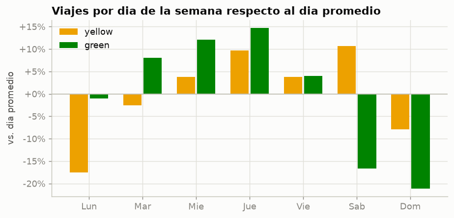

Los taxis amarillos funcionan como un servicio de tarde, noche y fin de semana. Su día de mayor demanda es el sábado y sus franjas más intensas son el jueves a las 21 horas, el sábado a las 18 horas y el miércoles a las 21 horas. En el jueves a las 21 horas se registran en promedio 8,583 viajes por hora, 1.77 veces la franja promedio. En días laborables el pico ocurre a las 18 horas y la demanda se mantiene alta hasta las 22 horas.

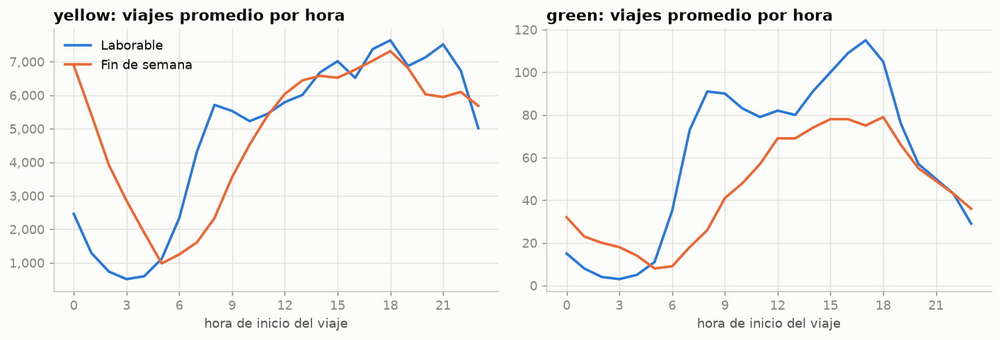

Los taxis verdes siguen un patrón propio del horario laboral. Su pico ocurre de martes a jueves a las 17 horas, con un segundo pico a las 8 horas, y su demanda cae entre 17 y 21 por ciento durante el fin de semana. Se trata de un servicio de traslados cotidianos más que de esparcimiento.

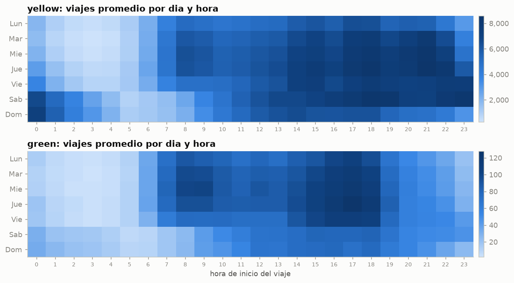

La madrugada del fin de semana constituye un mercado distinto. En los taxis amarillos, entre la medianoche y las tres de la mañana ocurre el 16.2 por ciento de los viajes de un día de fin de semana, frente al 4.3 por ciento en días laborables. A medianoche se registran 2.8 veces más viajes un sábado o domingo que un día laborable. En cambio, la hora pico matutina de las 8 horas prácticamente desaparece el fin de semana. La franja de menor demanda es el martes a las 3 horas, con 284 viajes por hora, treinta veces menos que la franja máxima.

El lunes es el día con menor demanda en los taxis amarillos, y esta caída no se explica por los días festivos. Al excluir los tres lunes feriados del periodo, el promedio apenas sube de 95,920 a 97,140 viajes. Sí influyen días con caídas extremas, como el lunes 23 de febrero, con solo 22,852 viajes, un 77 por ciento menos que un lunes típico. También el domingo 25 y el lunes 26 de enero. Estos días son candidatos a eventos externos como fenómenos climáticos, aunque su causa no se verificó con otras fuentes.

#### Pregunta 2. Zonas y viajes de aeropuerto

La distribución de los orígenes por distrito muestra que los taxis amarillos son un servicio de Manhattan, mientras que los taxis verdes tienen una presencia mucho mayor en Queens y Brooklyn.

| Distrito de origen | Taxis amarillos, porcentaje | Taxis verdes, porcentaje |
|---|---:|---:|
| Manhattan | 86.63 | 59.44 |
| Queens | 8.85 | 22.07 |
| Brooklyn | 3.60 | 15.81 |
| Bronx | 0.78 | 2.49 |
| Otros o desconocido | 0.14 | 0.20 |

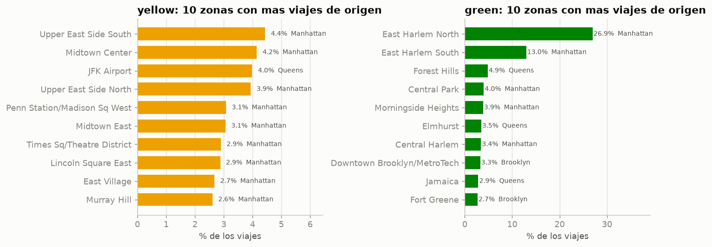

Los viajes de taxis amarillos están repartidos en muchas zonas de Manhattan. Sus diez zonas principales, entre ellas Upper East Side, Midtown, Penn Station y Times Square, suman solo el 33.7 por ciento de los orígenes. La única zona fuera de Manhattan entre las principales es el aeropuerto JFK, que ocupa el tercer lugar con el 3.99 por ciento. Los taxis verdes, por el contrario, están muy concentrados. East Harlem North y East Harlem South reúnen el 40 por ciento de sus orígenes. Este patrón es coherente con la restricción que impide a los taxis verdes recoger pasajeros en la calle en el centro de Manhattan.

La siguiente tabla caracteriza los viajes de taxis amarillos relacionados con aeropuertos.

| Categoría | Porcentaje de viajes | Porcentaje de ingresos | Distancia mediana en millas | Duración mediana en minutos | Total mediano en dólares | Porcentaje con tarifa fija de JFK |
|---|---:|---:|---:|---:|---:|---:|
| Desde JFK | 3.99 | 10.49 | 16.90 | 40.1 | 86.75 | 45.4 |
| Desde LaGuardia | 2.54 | 5.92 | 9.36 | 29.4 | 69.94 | 0.5 |
| Hacia LaGuardia | 0.82 | 1.91 | 9.90 | 28.0 | 69.91 | 0.2 |
| Hacia JFK | 0.64 | 1.97 | 16.99 | 50.4 | 95.46 | 67.7 |
| Hacia Newark | 0.17 | 0.74 | 17.36 | 37.5 | 131.70 | 0.1 |
| Sin aeropuerto | 91.83 | 78.96 | 1.78 | 13.3 | 22.45 | 0.1 |

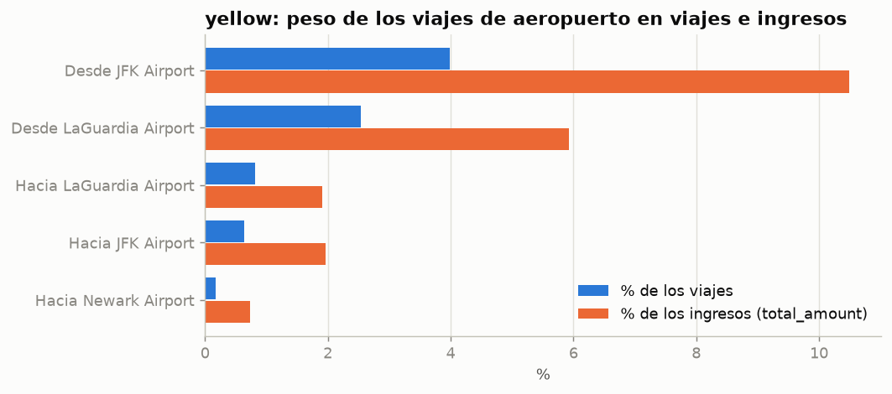

Los viajes de aeropuerto representan el 8.2 por ciento de los viajes de taxis amarillos, pero el 21.0 por ciento de sus ingresos. Un viaje desde JFK cuesta en mediana 86.75 dólares, casi cuatro veces el valor de un viaje urbano. Existe además una marcada asimetría. Desde los aeropuertos salen 1.84 millones de viajes y hacia ellos llegan solo 0.46 millones, cuatro veces menos. Esto sugiere que los pasajeros llegan al aeropuerto por otros medios, pero utilizan la fila de taxis al salir. La tarifa mediana de los viajes con JFK es exactamente de 70 dólares, el valor de la tarifa fija hacia Manhattan. Solo el 45 por ciento de los viajes desde JFK la utiliza, porque únicamente aplica a destinos dentro de Manhattan.

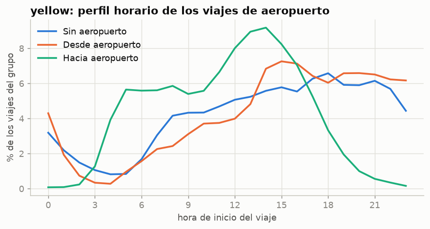

Los viajes hacia los aeropuertos comienzan desde las 5 horas, alcanzan su máximo a las 14 horas y casi desaparecen después de las 20 horas. Los viajes desde los aeropuertos crecen a partir del mediodía y se mantienen altos hasta la medianoche, en correspondencia con la llegada de vuelos. Se detectó además una anomalía. Existen 913 viajes de taxis amarillos registrados como originados en Newark, con una distancia mediana de 0.05 millas, una duración de 0.2 minutos y una tarifa mediana de 114 dólares. Los taxis amarillos no recogen pasajeros en Newark, por lo que se trata de registros con la zona de origen y la distancia mal capturadas. En los taxis verdes los aeropuertos son casi exclusivamente destino, pues solo 73 viajes salen de LaGuardia frente a 8,326 que llegan.

#### Pregunta 3. Viajes de taxis verdes tomados en la calle y despachados

La siguiente tabla compara los tres grupos de viajes de taxis verdes según su tipo de viaje.

| Característica | Tomado en la calle | Despachado | Sin registro |
|---|---:|---:|---:|
| Viajes | 266,102 | 10,452 | 47,677 |
| Porcentaje del total | 82.07 | 3.22 | 14.70 |
| Distancia mediana en millas | 1.93 | 4.05 | 5.01 |
| Duración mediana en minutos | 12.3 | 15.0 | 25.9 |
| Tarifa base mediana en dólares | 13.50 | 40.00 | 3.00 |
| Total mediano en dólares | 19.60 | 49.20 | 26.47 |
| Porcentaje con tarifa negociada | 0.7 | 99.8 | 0.0 |
| Porcentaje pagado con tarjeta | 76.6 | 84.3 | 0.0 |
| Porcentaje pagado en efectivo | 23.1 | 14.2 | 0.0 |
| Propina mediana con tarjeta, porcentaje | 20.0 | 13.0 | sin dato |
| Porcentaje del proveedor Myle | 0.0 | 0.0 | 73.1 |

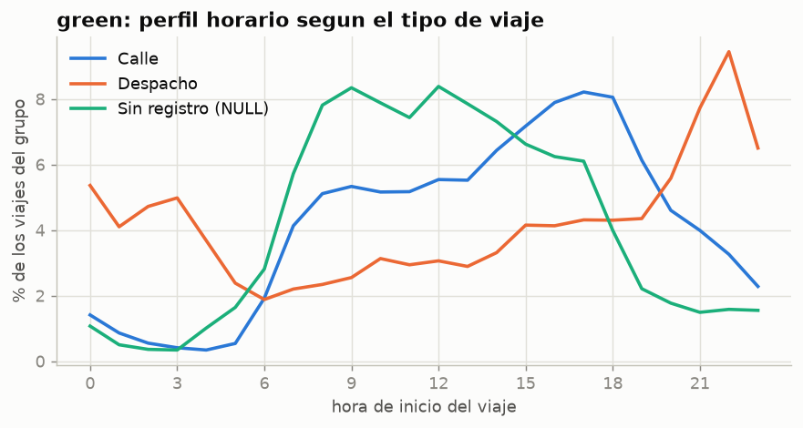

Los viajes tomados en la calle representan el servicio característico de los taxis verdes. Son viajes cortos, concentrados en East Harlem, que reúne el 47 por ciento de sus orígenes, y con pico en la tarde. Es además el grupo con mayor uso de efectivo.

Los viajes despachados constituyen un producto diferente. El 99.8 por ciento utiliza una tarifa negociada de antemano, cuestan tres veces más, recorren el doble de distancia y se originan de forma dispersa en Queens y Brooklyn. Su perfil horario es nocturno, con el máximo a las 22 horas, y es el único grupo con actividad relevante entre la medianoche y las 3 horas. Funcionan como un servicio de automóvil por encargo y dejan menos propina.

Los viajes sin registro no son un error aleatorio, sino un tercer canal de servicio. El 73 por ciento pertenece al proveedor Myle y carecen de tipo de viaje, tipo de pago y número de pasajeros. Ocurren de día y son los de mayor duración. Desde junio, el 39 por ciento incluye un código de solicitud por aplicación. Su tarifa base mediana es de solo 3 dólares, frente a un total de 26.47, lo que indica que en este grupo la tarifa base no representa el cobro real. Este grupo es el equivalente, en los taxis verdes, de los viajes con tarifa flexible de los taxis amarillos.

#### Pregunta 4. Pago y propinas

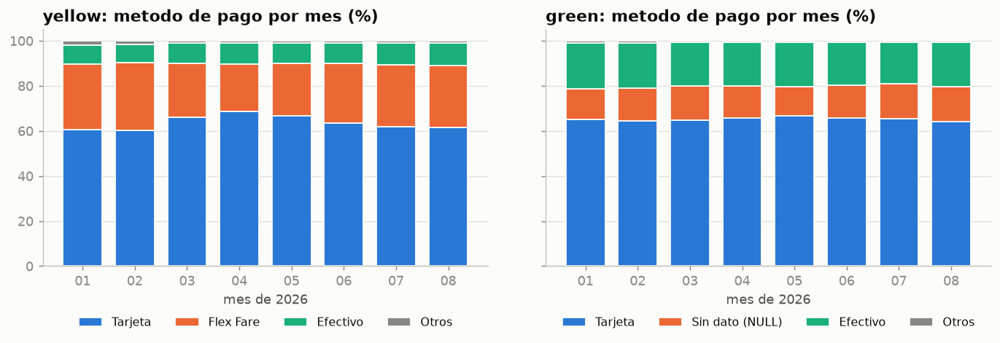

En los taxis amarillos, la tarjeta representa entre el 60 y el 69 por ciento de los viajes cada mes y la tarifa flexible entre el 21 y el 30 por ciento. El efectivo se sitúa entre el 8 y el 10 por ciento, y las disputas y los viajes sin cargo suman cerca del 1 por ciento. La tarifa flexible descendió del 29 por ciento en enero al 21 por ciento en abril y volvió al 28 por ciento en agosto, mientras la tarjeta siguió el movimiento contrario. En los taxis verdes la tarjeta representa cerca del 65 por ciento, el efectivo entre el 19 y el 20 por ciento, el doble que en los amarillos, y los viajes sin tipo de pago entre el 13 y el 16 por ciento. Esta mezcla es estable en todos los meses.

Para comprender la naturaleza de la tarifa flexible se analizó la columna de origen de la solicitud, disponible desde junio. Esta columna solo tiene valor en los viajes con tarifa flexible; en los pagos con tarjeta y efectivo siempre está vacía. El 79.25 por ciento de estos viajes proviene del código HV0003 y el 6.15 por ciento del código HV0005, que corresponden a las licencias de Uber y Lyft. El 13.77 por ciento proviene de un código identificado como A. Se concluye que la tarifa flexible corresponde a viajes de taxi amarillo solicitados y pagados mediante una aplicación, con precio acordado de antemano. Esto explica que no registren pasajeros, código de tarifa ni recargos, y que casi nunca registren propina, ya que la propina de la aplicación no pasa por el taxímetro.

La siguiente tabla resume la propina según el método de pago.

| Tipo de taxi | Método de pago | Viajes | Viajes con propina | Porcentaje con propina | Propina mediana en dólares | Propina mediana como porcentaje |
|---|---|---:|---:|---:|---:|---:|
| Amarillo | Tarjeta | 18,461,107 | 16,821,288 | 91.12 | 3.51 | 20.0 |
| Amarillo | Tarifa flexible | 7,044,806 | 582,448 | 8.27 | 3.94 | 16.5 |
| Amarillo | Efectivo | 2,560,893 | 172 | 0.01 | 3.59 | 20.0 |
| Verde | Tarjeta | 212,519 | 194,105 | 91.34 | 3.35 | 20.0 |
| Verde | Efectivo | 62,931 | 0 | 0.00 | sin dato | sin dato |
| Verde | Sin tipo de pago | 47,677 | 7,364 | 15.45 | 3.90 | 19.8 |

Con tarjeta, nueve de cada diez viajes registran propina y su mediana es exactamente del 20 por ciento, que coincide con uno de los porcentajes sugeridos en la pantalla de pago. En efectivo, en cambio, la propina prácticamente no se registra, pues solo 172 de 2.56 millones de viajes la incluyen. Esto no significa que no se dé propina, sino que el conjunto de datos no la captura. Por esa razón, cualquier promedio de propina que incluya el efectivo está subestimado.

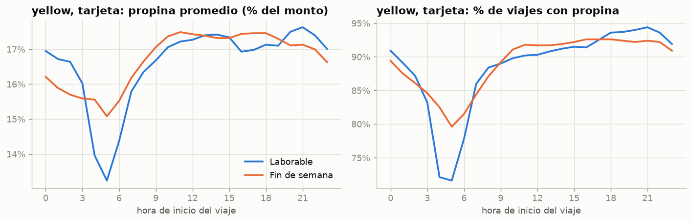

En los pagos con tarjeta de taxis amarillos, la propina depende de la hora. La proporción de viajes con propina desciende desde cerca del 94 por ciento a las 20 y 21 horas hasta el 72 por ciento entre las 4 y las 5 horas de un día laborable. La propina promedio baja del 17.6 al 13.2 por ciento en esas mismas horas. Entre las 8 y las 23 horas el porcentaje es estable, entre 16.3 y 17.6 por ciento.

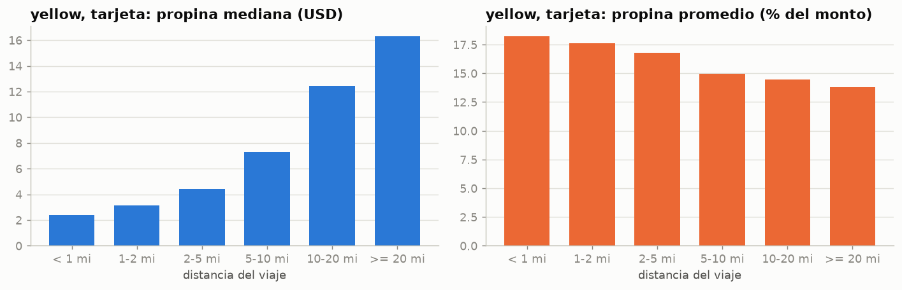

La propina en dólares crece con la distancia, desde 2.39 dólares en viajes de menos de una milla hasta 16.29 dólares en viajes de veinte millas o más. Sin embargo, como porcentaje disminuye del 18.2 al 13.8 por ciento, y la proporción de viajes con propina baja del 94 al 79 por ciento. El número de pasajeros, en cambio, casi no influye, pues la propina se mantiene entre 16.9 y 17.8 por ciento con cualquier número de pasajeros.

#### Pregunta 5. Tarifa por milla

El análisis se limitó a los viajes con tarifa estándar de taxímetro, para excluir tarifas fijas, negociadas y flexibles.

| Distancia del viaje | Viajes de taxis amarillos | Tarifa mediana en dólares | Dólares por milla, mediana | Dólares por milla, percentil 25 | Dólares por milla, percentil 75 |
|---|---:|---:|---:|---:|---:|
| Menos de media milla | 965,099 | 5.10 | 14.87 | 12.61 | 19.75 |
| De media a una milla | 4,150,015 | 7.90 | 10.20 | 8.89 | 12.15 |
| De una a dos millas | 6,853,251 | 11.40 | 8.01 | 7.10 | 9.43 |
| De dos a tres millas | 3,045,640 | 16.30 | 6.78 | 6.05 | 7.80 |
| De tres a cinco millas | 2,051,227 | 21.90 | 5.87 | 5.26 | 6.68 |
| De cinco a diez millas | 1,635,982 | 34.50 | 4.70 | 4.29 | 5.24 |
| De diez a veinte millas | 711,244 | 52.00 | 4.20 | 3.96 | 4.55 |
| Veinte millas o más | 56,546 | 93.30 | 3.80 | 3.70 | 3.98 |

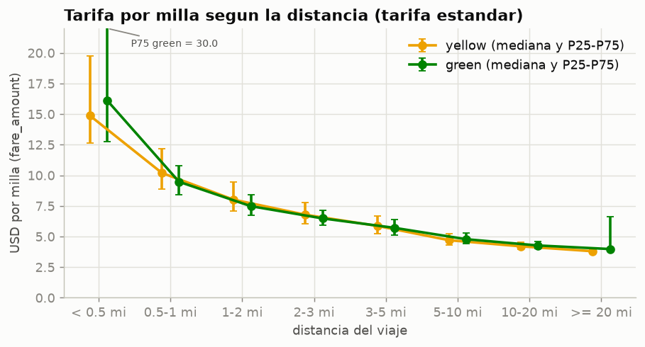

Una milla cuesta casi cuatro veces más en un viaje de menos de media milla que en uno de más de veinte millas. El cargo inicial fijo se reparte entre pocas millas en los viajes cortos, mientras que en los largos el precio por milla se estabiliza en torno a cuatro dólares. Los taxis amarillos y verdes presentan prácticamente la misma curva, porque utilizan el mismo esquema de taxímetro, aunque los verdes muestran mayor dispersión en los extremos.

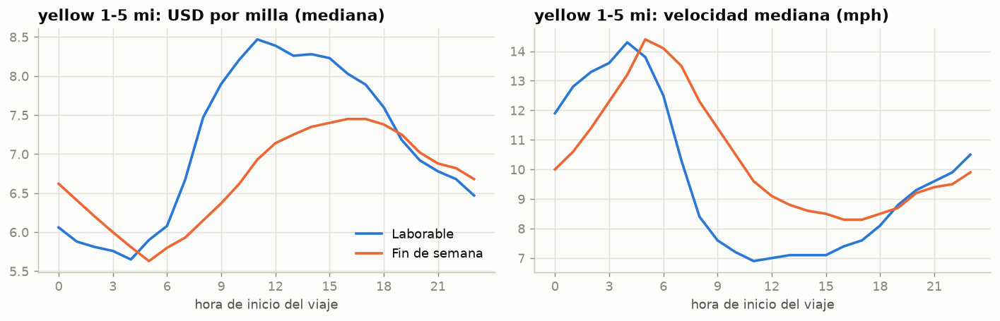

La congestión encarece la milla. En viajes de taxis amarillos de una a cinco millas en días laborables, la milla cuesta 5.65 dólares a las 4 horas y 8.47 dólares a las 11 horas, un aumento del 50 por ciento. En esas mismas horas, la velocidad mediana desciende de 14.3 a 6.9 millas por hora. Ambas curvas son prácticamente un reflejo una de la otra, porque el taxímetro también cobra por el tiempo transcurrido a baja velocidad. En consecuencia, un mismo trayecto cuesta más cuando hay tráfico. En el fin de semana la congestión aparece más tarde y es menor, con un máximo de 7.45 dólares por milla entre las 16 y las 17 horas y una velocidad mínima de 8.3 millas por hora.

#### Pregunta 6. Concentración de los valores atípicos

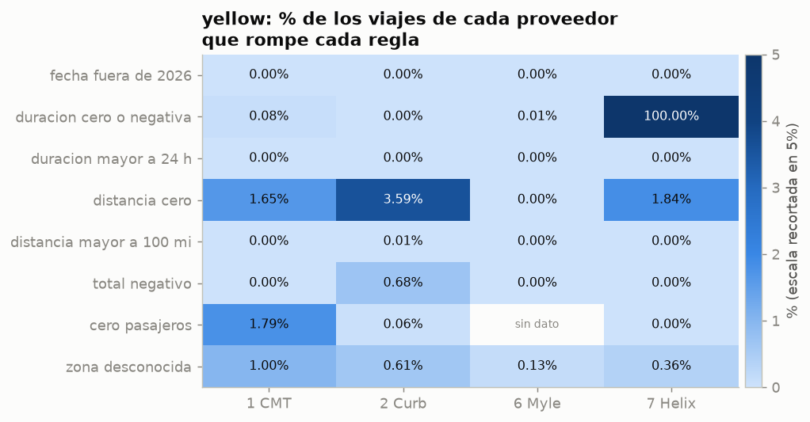

La siguiente tabla presenta, para las reglas más relevantes en taxis amarillos, el proveedor con la mayor tasa de incumplimiento y la parte del problema que le corresponde.

| Regla | Proveedor con la mayor tasa | Porcentaje de sus viajes | Porcentaje del total de la regla | Porcentaje de los viajes que aporta el proveedor |
|---|---|---:|---:|---:|
| Duración cero o negativa | Helix | 100.00 | 98.8 | 1.2 |
| Total negativo | Curb | 0.68 | 100.0 | 80.2 |
| Cero pasajeros | Creative Mobile Technologies | 1.79 | 89.7 | 20.8 |
| Distancia cero | Curb | 3.59 | 89.8 | 80.2 |
| Fecha fuera de 2026 | Curb | menos de 0.01 | 100.0 | 80.2 |
| Zona desconocida | Creative Mobile Technologies | 1.00 | 27.1 | 18.4 |

Cada tipo de error tiene un responsable claro, lo que indica que los errores se originan en el sistema de registro de cada proveedor y no en el comportamiento de los viajes. El proveedor Helix registra la hora de fin igual a la de inicio en todos sus viajes y en todos los meses, es decir, no envía la hora de llegada. Concentra el 98.8 por ciento de los viajes de duración cero de los taxis amarillos. En consecuencia, la regla que exige una duración positiva elimina a este proveedor completo del análisis. Solo Curb registra las reversiones como filas con total negativo, tanto en taxis amarillos como verdes. Creative Mobile Technologies concentra casi el 90 por ciento de los viajes con cero pasajeros, probablemente porque registra ese valor por defecto cuando el conductor no lo captura. En los taxis verdes el patrón se repite.

En el tiempo, las tasas de error son estables, con una excepción. La proporción de viajes de duración cero de Creative Mobile Technologies aumentó de cerca de 0.04 por ciento a 0.41 por ciento en agosto, diez veces más, un cambio que conviene vigilar en los próximos meses.

Las distancias absurdas corresponden en realidad a dos fenómenos distintos. Por un lado, 762 viajes con tarifa flexible de Curb tienen distancias medianas de 87,993 millas, con veinticuatro minutos de duración y treinta y tres dólares de tarifa. Esto implica una velocidad de 214,000 millas por hora, de modo que se trata de un error del campo de distancia en los viajes por aplicación. El mismo fenómeno se observa en los taxis verdes sin tipo de pago. Por otro lado, los viajes de más de cien millas pagados con tarjeta o efectivo recorren alrededor de 128 millas en dos o tres horas, cobran entre 300 y 600 dólares y tienen velocidades cercanas a cincuenta millas por hora. Son viajes largos reales fuera de la ciudad, que la regla de distancia máxima descarta igualmente. Para estudiar viajes interurbanos convendría reemplazar esa regla por una de velocidad máxima.

### 4.5 Hallazgos relevantes

El primer hallazgo es que la tarifa flexible corresponde a viajes de taxi solicitados por aplicación, principalmente Uber. Representa entre el 21 y el 30 por ciento de los viajes de taxis amarillos cada mes. El 79 por ciento de estos viajes trae el código de licencia de Uber en la columna de origen de la solicitud. Este hallazgo explica los nulos estructurales de la cuarta parte de los viajes amarillos, su propina casi inexistente y las distancias absurdas de uno de los proveedores. También implica que la tarifa flexible debe tratarse como un canal de venta distinto y no como un simple método de pago.

El segundo hallazgo es que los errores de datos tienen un proveedor responsable. Helix registra duración cero en todos sus viajes, solo Curb registra totales negativos y Creative Mobile Technologies concentra la mayoría de los viajes con cero pasajeros. Las reglas de limpieza del Ejercicio 3 eliminan sin advertencia a un proveedor completo. Por eso, las reglas de calidad deben evaluarse por proveedor antes de aplicarse.

El tercer hallazgo es que los aeropuertos valen mucho más de lo que pesan en volumen. Representan el 8.2 por ciento de los viajes de taxis amarillos, pero el 21 por ciento de sus ingresos. Además, por cada viaje hacia un aeropuerto hay cuatro que salen de uno.

El cuarto hallazgo es que la congestión encarece cada milla en un cincuenta por ciento. Un mismo viaje urbano cuesta 5.65 dólares por milla a las 4 horas y 8.47 dólares a las 11 horas de un día laborable, cuando la velocidad se reduce a la mitad. A su vez, el precio por milla es casi cuatro veces mayor en los viajes más cortos que en los más largos.

El quinto hallazgo es que la propina en efectivo no existe en los datos. Solo 172 de 2.56 millones de viajes pagados en efectivo registran propina. Con tarjeta, el 91 por ciento de los viajes deja propina, con una mediana exacta del 20 por ciento, que disminuye con la distancia y durante la madrugada.

El sexto hallazgo es que los taxis amarillos y verdes atienden mercados distintos. Los amarillos son un servicio de Manhattan, con picos de noche y de fin de semana. Los verdes son un servicio de traslados cotidianos, con pico a las 17 horas entre martes y jueves, menor demanda en fin de semana y el 40 por ciento de sus orígenes en East Harlem. Dentro de los verdes, los viajes despachados conforman un servicio aparte, con tarifa negociada, horario nocturno y un costo tres veces mayor.

### Limitaciones del análisis

El periodo analizado comprende de enero a agosto de 2026, por lo que no permite observar la estacionalidad anual completa ni comparar con años anteriores. Los viajes de Helix quedan fuera de las preguntas uno a cinco por su error de duración. La columna de origen de la solicitud solo existe desde junio y no figura en el diccionario de datos. Su interpretación como Uber y Lyft se basa en los códigos de licencia que publica la comisión. Por último, las causas de los días con demanda extrema no se verificaron con fuentes externas.

---

## Conclusiones

El laboratorio permitió construir un flujo de trabajo completo y reproducible para el análisis de un conjunto de datos de gran volumen, sin depender de un servidor de base de datos tradicional. El ambiente basado en contenedores garantiza que el trabajo pueda repetirse con las mismas versiones de software en cualquier equipo. El sistema de descarga corregido obtiene de forma automática y verificable todos los archivos publicados, evita descargas innecesarias y detecta archivos incompletos o actualizados.

La consulta directa de archivos Parquet con DuckDB demostró ser una estrategia eficaz. Permitió explorar treinta millones de registros en segundos y con un consumo de memoria muy inferior al de las herramientas que cargan los datos completos. La exploración inicial reveló problemas de calidad relevantes, cuyo tratamiento se documentó sin alterar los datos originales. El análisis exploratorio, por su parte, produjo hallazgos con valor tanto analítico como operativo. Entre ellos destacan la naturaleza de los viajes por aplicación, el origen de los errores en proveedores específicos, el peso económico de los aeropuertos y el efecto de la congestión sobre el precio.

Estos resultados muestran que la calidad de un análisis depende tanto de las herramientas como de la comprensión de los datos. Varias de las conclusiones más importantes surgieron precisamente al investigar por qué los datos no se comportaban como se esperaba.

---

## Anexo A. Consultas SQL del Ejercicio 3

Este anexo reúne el texto de las consultas utilizadas en el Ejercicio 3, en atención al inciso 3.8. Las mismas consultas se encuentran como archivos individuales en la carpeta de consultas del proyecto, dentro de la subcarpeta correspondiente a la exploración.

### Consulta 1. Cantidad de archivos disponibles

```sql
SELECT
    coalesce(split_part(file_name, '/', 3), 'TOTAL')            AS tipo,
    coalesce(split_part(file_name, '/', 4), '')                 AS anio,
    count(*)                                                    AS archivos,
    round(sum(file_size_bytes) / 1024 ^ 2, 1)                   AS tamanio_mib
FROM parquet_file_metadata('data/raw/*/*/*.parquet')
GROUP BY ROLLUP ((split_part(file_name, '/', 3), split_part(file_name, '/', 4)))
ORDER BY tipo = 'TOTAL', tipo DESC, anio;
```

### Consulta 2. Cantidad de registros a partir de los metadatos

```sql
SELECT
    split_part(file_name, '/', 3)                        AS tipo,
    regexp_extract(file_name, '(\d{4}-\d{2})', 1)        AS mes,
    num_rows                                             AS filas,
    num_row_groups                                       AS row_groups,
    round(file_size_bytes / 1024 ^ 2, 1)                 AS tamanio_mib,
    created_by
FROM parquet_file_metadata('data/raw/*/2026/*.parquet')
ORDER BY tipo DESC, mes;
```

### Consulta 3. Cantidad de registros recorriendo los datos

```sql
SELECT
    coalesce(tipo, 'TOTAL')  AS tipo,
    count(*)                 AS archivos,
    sum(filas)               AS registros
FROM (
    SELECT split_part(filename, '/', 3) AS tipo, filename, count(*) AS filas
    FROM read_parquet('data/raw/*/2026/*.parquet', union_by_name = true, filename = true)
    GROUP BY ALL
)
GROUP BY ROLLUP (tipo)
ORDER BY tipo = 'TOTAL', tipo DESC;
```

### Consulta 4. Columnas presentes en los archivos

```sql
WITH esquema AS (
    SELECT
        split_part(file_name, '/', 3)  AS tipo,
        file_name,
        name                            AS columna,
        column_id
    FROM parquet_schema('data/raw/*/2026/*.parquet')
    WHERE num_children IS NULL
)
SELECT
    columna,
    min(column_id) FILTER (WHERE tipo = 'yellow')                 AS posicion_yellow,
    count(DISTINCT file_name) FILTER (WHERE tipo = 'yellow')      AS archivos_yellow,
    min(column_id) FILTER (WHERE tipo = 'green')                  AS posicion_green,
    count(DISTINCT file_name) FILTER (WHERE tipo = 'green')       AS archivos_green
FROM esquema
GROUP BY columna
ORDER BY coalesce(posicion_yellow, posicion_green), posicion_green;
```

### Consulta 5. Tipos de datos de las columnas

```sql
SELECT
    split_part(file_name, '/', 3)            AS tipo,
    name                                     AS columna,
    type                                     AS tipo_parquet,
    converted_type                           AS tipo_convertido,
    duckdb_type                              AS tipo_duckdb,
    count(DISTINCT file_name)                AS archivos
FROM parquet_schema('data/raw/*/2026/*.parquet')
WHERE num_children IS NULL
GROUP BY ALL
ORDER BY tipo DESC, min(column_id);
```

### Consultas 6 y 7. Muestra de registros

La consulta 7 es idéntica a la 6, pero utiliza los archivos de taxis verdes.

```sql
SELECT *
FROM read_parquet('data/raw/yellow/2026/*.parquet', union_by_name = true) AS t
ORDER BY hash(t)
LIMIT 10;
```

### Consultas 8 y 9. Perfil estadístico por columna

La consulta 9 es idéntica a la 8, pero utiliza los archivos de taxis verdes.

```sql
SELECT column_name, column_type, min, max, approx_unique,
       round(TRY_CAST(avg AS DOUBLE), 2) AS avg, q50, null_percentage
FROM (SUMMARIZE SELECT * FROM read_parquet('data/raw/yellow/2026/*.parquet', union_by_name = true));
```

### Consulta 10. Fechas fuera del periodo esperado

```sql
WITH viajes AS (
    SELECT 'yellow' AS tipo, filename, tpep_pickup_datetime AS inicio
    FROM read_parquet('data/raw/yellow/2026/*.parquet', union_by_name = true, filename = true)
    UNION ALL
    SELECT 'green', filename, lpep_pickup_datetime
    FROM read_parquet('data/raw/green/2026/*.parquet', union_by_name = true, filename = true)
),
clasificados AS (
    SELECT
        tipo,
        inicio,
        CASE
            WHEN strftime(inicio, '%Y-%m') = regexp_extract(filename, '(\d{4}-\d{2})', 1)
                THEN '1 mes del archivo'
            WHEN year(inicio) = 2026 THEN '2 otro mes de 2026'
            ELSE '3 otro anio'
        END AS ubicacion
    FROM viajes
)
SELECT tipo, ubicacion, count(*) AS filas, min(inicio) AS minimo, max(inicio) AS maximo
FROM clasificados
GROUP BY ALL
ORDER BY tipo DESC, ubicacion;
```

### Consulta 11. Patrón de valores nulos

```sql
WITH viajes AS (
    SELECT 'yellow' AS tipo, payment_type, passenger_count, RatecodeID,
           store_and_fwd_flag, congestion_surcharge
    FROM read_parquet('data/raw/yellow/2026/*.parquet', union_by_name = true)
    UNION ALL
    SELECT 'green', payment_type, passenger_count, RatecodeID,
           store_and_fwd_flag, congestion_surcharge
    FROM read_parquet('data/raw/green/2026/*.parquet', union_by_name = true)
)
SELECT
    tipo,
    payment_type,
    count(*)                                                AS filas,
    count(*) FILTER (WHERE passenger_count IS NULL)         AS pasajeros_nulos,
    count(*) FILTER (WHERE RatecodeID IS NULL)              AS ratecode_nulos,
    count(*) FILTER (WHERE store_and_fwd_flag IS NULL)      AS flag_nulos,
    count(*) FILTER (WHERE congestion_surcharge IS NULL)    AS congestion_nulos
FROM viajes
GROUP BY ALL
ORDER BY tipo DESC, payment_type NULLS LAST;
```

### Consulta 12. Valores de las columnas categóricas

```sql
WITH viajes AS (
    SELECT 'yellow' AS tipo,
           VendorID::VARCHAR      AS VendorID,
           RatecodeID::VARCHAR    AS RatecodeID,
           payment_type::VARCHAR  AS payment_type,
           store_and_fwd_flag,
           NULL::VARCHAR          AS trip_type,
           request_source
    FROM read_parquet('data/raw/yellow/2026/*.parquet', union_by_name = true)
    UNION ALL
    SELECT 'green',
           VendorID::VARCHAR,
           RatecodeID::VARCHAR,
           payment_type::VARCHAR,
           store_and_fwd_flag,
           trip_type::VARCHAR,
           request_source
    FROM read_parquet('data/raw/green/2026/*.parquet', union_by_name = true)
),
largo AS (
    FROM viajes
    UNPIVOT INCLUDE NULLS (valor FOR columna IN
        (VendorID, RatecodeID, payment_type, store_and_fwd_flag, trip_type, request_source))
)
SELECT
    columna,
    coalesce(valor, 'NULL')                          AS valor,
    count(*) FILTER (WHERE tipo = 'yellow')          AS yellow,
    count(*) FILTER (WHERE tipo = 'green')           AS green
FROM largo
WHERE NOT (columna = 'trip_type' AND tipo = 'yellow')
GROUP BY ALL
ORDER BY columna, valor;
```

### Consulta 13. Reglas de calidad

```sql
WITH viajes AS (
    SELECT 'yellow' AS tipo, tpep_pickup_datetime AS inicio,
           tpep_dropoff_datetime AS fin, passenger_count, trip_distance,
           fare_amount, total_amount, PULocationID, DOLocationID
    FROM read_parquet('data/raw/yellow/2026/*.parquet', union_by_name = true)
    UNION ALL
    SELECT 'green', lpep_pickup_datetime, lpep_dropoff_datetime,
           passenger_count, trip_distance, fare_amount, total_amount,
           PULocationID, DOLocationID
    FROM read_parquet('data/raw/green/2026/*.parquet', union_by_name = true)
),
conteos AS (
    SELECT
        tipo,
        count(*)                                                AS total,
        count(*) FILTER (WHERE year(inicio) <> 2026)            AS "01 inicio fuera de 2026",
        count(*) FILTER (WHERE fin < inicio)                    AS "02 fin antes del inicio",
        count(*) FILTER (WHERE fin = inicio)                    AS "03 duracion cero",
        count(*) FILTER (WHERE fin - inicio > INTERVAL 24 HOUR) AS "04 duracion mayor a 24 h",
        count(*) FILTER (WHERE trip_distance = 0)               AS "05 distancia cero",
        count(*) FILTER (WHERE trip_distance > 100)             AS "06 distancia mayor a 100 millas",
        count(*) FILTER (WHERE fare_amount < 0)                 AS "07 tarifa negativa",
        count(*) FILTER (WHERE total_amount < 0)                AS "08 total negativo",
        count(*) FILTER (WHERE fare_amount > 1000)              AS "09 tarifa mayor a 1000 USD",
        count(*) FILTER (WHERE passenger_count = 0)             AS "10 cero pasajeros",
        count(*) FILTER (WHERE passenger_count > 6)             AS "11 mas de 6 pasajeros",
        count(*) FILTER (WHERE PULocationID IN (264, 265)
                            OR DOLocationID IN (264, 265))      AS "12 zona desconocida o fuera de NYC"
    FROM viajes
    GROUP BY tipo
),
largo AS (
    UNPIVOT conteos ON COLUMNS(* EXCLUDE (tipo, total)) INTO NAME regla VALUE filas
)
SELECT
    regla,
    max(filas) FILTER (WHERE tipo = 'yellow')                             AS yellow,
    round(max(100.0 * filas / total) FILTER (WHERE tipo = 'yellow'), 4)   AS pct_yellow,
    max(filas) FILTER (WHERE tipo = 'green')                              AS green,
    round(max(100.0 * filas / total) FILTER (WHERE tipo = 'green'), 4)    AS pct_green
FROM largo
GROUP BY regla
ORDER BY regla;
```

### Consulta 14. Registros duplicados

```sql
SELECT 'yellow' AS tipo, count(*) AS filas, count(DISTINCT hash(t)) AS filas_distintas,
       count(*) - count(DISTINCT hash(t)) AS duplicados
FROM read_parquet('data/raw/yellow/2026/*.parquet', union_by_name = true) AS t
UNION ALL
SELECT 'green', count(*), count(DISTINCT hash(t)), count(*) - count(DISTINCT hash(t))
FROM read_parquet('data/raw/green/2026/*.parquet', union_by_name = true) AS t;
```

### Consulta 15. Detalle de los registros duplicados

```sql
WITH hashes_repetidos AS (
    SELECT hash(t) AS h
    FROM read_parquet('data/raw/yellow/2026/*.parquet', union_by_name = true) AS t
    GROUP BY h
    HAVING count(*) > 1
),
filas_repetidas AS (
    SELECT hash(t) AS h, t
    FROM read_parquet('data/raw/yellow/2026/*.parquet', union_by_name = true) AS t
    WHERE hash(t) IN (SELECT h FROM hashes_repetidos)
)
SELECT
    count(*)                              AS repeticiones,
    count(DISTINCT t)                     AS versiones_distintas,
    any_value(t).VendorID                 AS VendorID,
    any_value(t).tpep_pickup_datetime     AS inicio,
    any_value(t).tpep_dropoff_datetime    AS fin,
    any_value(t).PULocationID             AS origen,
    any_value(t).DOLocationID             AS destino,
    any_value(t).trip_distance            AS distancia,
    any_value(t).total_amount             AS total,
    any_value(t).payment_type             AS payment_type
FROM filas_repetidas
GROUP BY h
ORDER BY inicio;
```

### Consulta 16. Consistencia del monto total

```sql
WITH diferencias AS (
    SELECT
        payment_type,
        round(total_amount - (fare_amount + extra + mta_tax + tip_amount
              + tolls_amount + improvement_surcharge
              + coalesce(congestion_surcharge, 0) + coalesce(Airport_fee, 0)
              + coalesce(cbd_congestion_fee, 0)), 2) AS diferencia
    FROM read_parquet('data/raw/yellow/2026/*.parquet', union_by_name = true)
)
SELECT
    payment_type,
    diferencia,
    count(*)                                                AS filas,
    round(100.0 * count(*) / sum(count(*)) OVER (), 2)      AS pct_del_total
FROM diferencias
GROUP BY payment_type, diferencia
QUALIFY row_number() OVER (ORDER BY count(*) DESC) <= 10
ORDER BY filas DESC;
```

---

## Anexo B. Ubicación de los productos del laboratorio

La siguiente tabla indica dónde se encuentra cada producto del trabajo dentro del repositorio.

| Producto | Ubicación en el repositorio |
|---|---|
| Procedimiento para levantar el ambiente y reproducir el trabajo | Archivo README en la raíz del repositorio |
| Script de descarga de datos | Carpeta scripts, archivo download_data.py |
| Script de ejecución de consultas | Carpeta scripts, archivo run_sql.py |
| Documentación del sistema de descarga | Carpeta docs, archivo descarga_datos.md |
| Consultas del Ejercicio 3 | Carpeta sql, subcarpeta 03_exploracion |
| Cuaderno del Ejercicio 3 | Carpeta notebooks, archivo 03_exploracion_parquet.ipynb |
| Documentación detallada del Ejercicio 3 | Carpeta docs, archivo 03_consultas_parquet.md |
| Consultas del Ejercicio 4 | Carpeta sql, subcarpeta 04_analisis |
| Cuaderno del Ejercicio 4 | Carpeta notebooks, archivo 04_analisis_exploratorio.ipynb |
| Documentación detallada del Ejercicio 4 | Carpeta docs, archivo 04_analisis_exploratorio.md |
| Figuras del informe | Carpeta docs, subcarpeta figuras |
